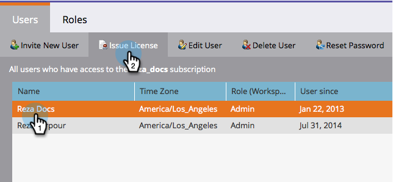
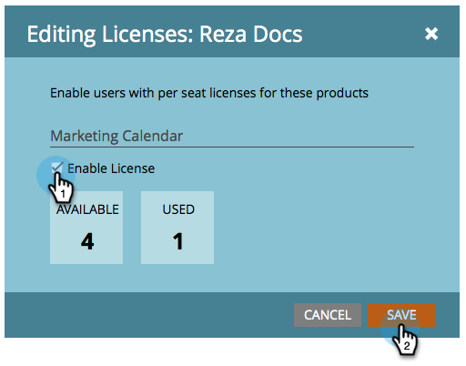
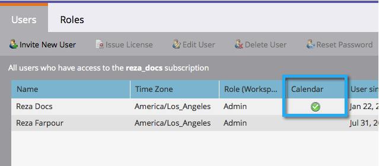

# Issue/Revoke a Marketing Calendar License {#issue-revoke-a-marketing-calendar-license}

>[!NOTE]
>
>**Admin Permissions Required**

To make use of your [Marketing Calendar](/help/marketo/product-docs/core-marketo-concepts/marketing-calendar/understanding-the-calendar/navigating-the-marketing-calendar.md){target="_blank"} seats, you need to issue licenses to users who need access. Here's how.

1. Go to the **[!UICONTROL Admin]** section.

   

1. Click **[!UICONTROL Users & Roles]**.

   

1. Select the user(s) and click **[!UICONTROL Issue License]**.

   >[!TIP]
   >
   >Use **Ctrl/Cmd+click** to select multiple users in one go.

   

1. Check **[!UICONTROL Enable License]** and click **[!UICONTROL Save]**.

   >[!NOTE]
   >
   >There is a limit of 5 licenses. If you need more, please contact your sales rep.

   

   Nicely done! See the green checkmark under 'Calendar?'

   
