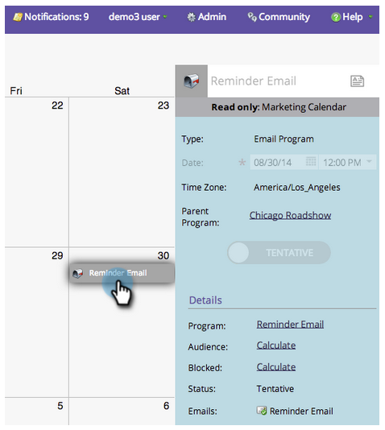
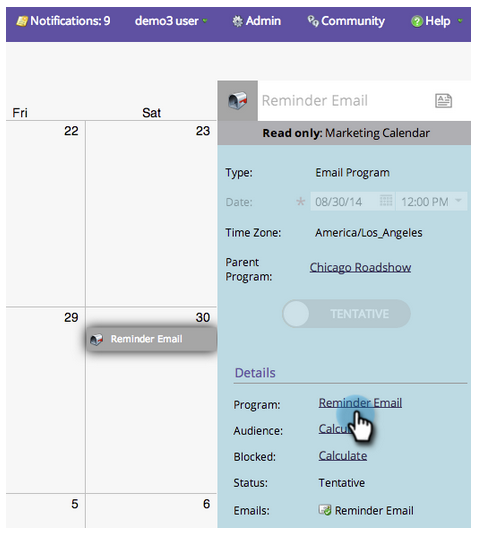

# View Entry Details {#view-entry-details}

When you view entry details in the Marketing Calendar, you can see all sorts of cool stuff about an entry.

1. Select an entry from the calendar.

   

1. Entries are read-only in the Marketing Calendar. Navigate to the program to make edits.

   

>[!TIP]
>
>Try right-clicking on the details on the right. You can see menus to navigate or pop up the editors. Nice, right?
