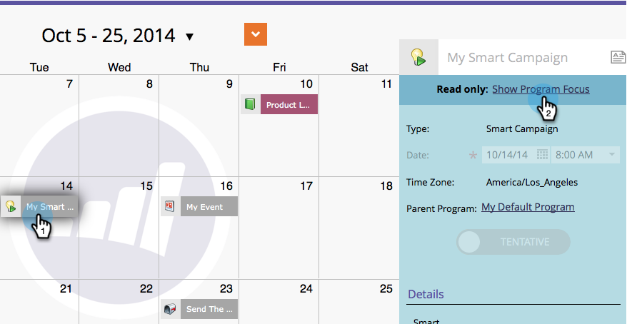
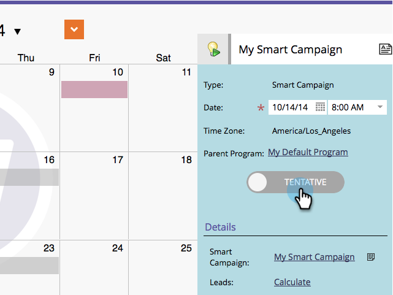
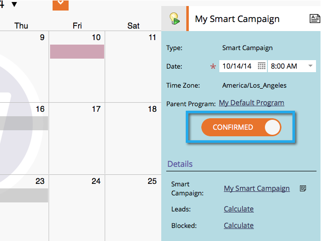

# Confirm Entries Directly In the Marketing Calendar {#confirm-entries-directly-in-the-marketing-calendar}

Smart campaigns and email programs can be created as tentative entries and must be confirmed for anything to actually happen. Here's how.

1. Go to the **[!UICONTROL Calendar]**.

   

1. Select the entry you want to confirm, and click on **[!UICONTROL Show Program Focus]**.

   

1. Go ahead and confirm the entry.

   

   Confirming runs a series of validation processes and if everything checks out, the entry will be confirmed.

   
