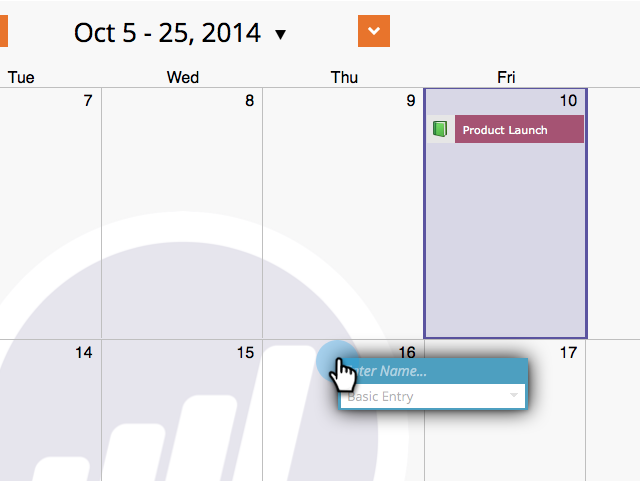
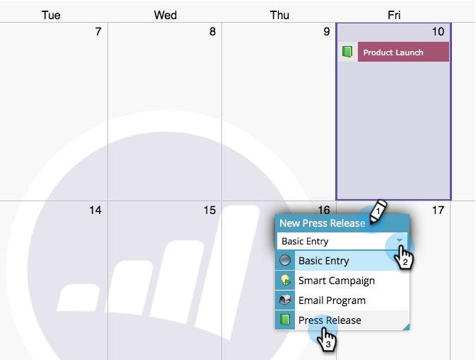
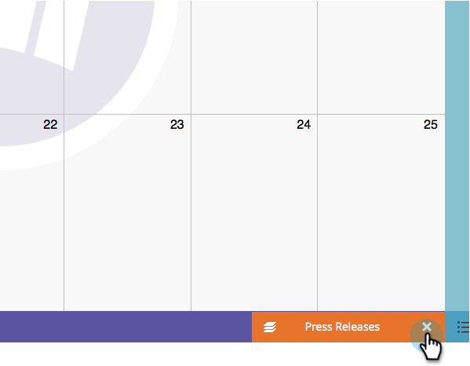

# Create Entries Directly in the Marketing Calendar {#create-entries-directly-in-the-marketing-calendar}

Marketo allows you to create entries directly in your Marketing Calendar by using the program focus mode. You can create the following entry types:

* Basic Entries
* Custom Entries
* Email Programs
* Smart Campaigns

Here's how.

1. Go to the **Calendar**.

   

   Select a previous entry and click Show Program Focus.
   

1. Once in program focus mode, select the day of your choice to add an entry.

   

1. Name your entry and select a type.

   

   >[!TIP]
   >
   >Notice you can also create **Smart Campaigns**, **Email Programs** and **Basic Entries** in this same manner.

1. When done editing, close program focus mode.

   

>[!NOTE]
>
>**Related Articles**
>
>* [Edit Entries Directly In the Marketing Calendar](edit-entries-directly-in-the-marketing-calendar.md)
>

