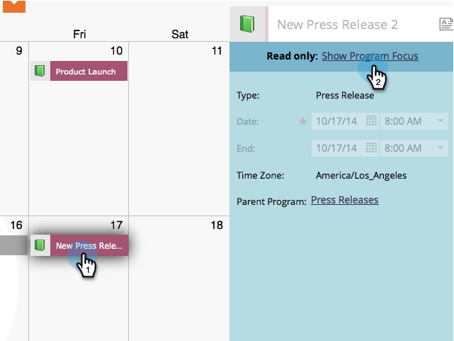

# Delete Entries Directly In the Marketing Calendar {#delete-entries-directly-in-the-marketing-calendar}

In addition to [creating](/help/marketo/product-docs/core-marketo-concepts/marketing-calendar/working-with-the-calendar/create-entries-directly-in-the-marketing-calendar.md) and [editing](/help/marketo/product-docs/core-marketo-concepts/marketing-calendar/working-with-the-calendar/edit-entries-directly-in-the-marketing-calendar.md) entries, you can delete them directly in the Marketing Calendar. Here's how.

1. Go to the **[!UICONTROL Calendar]**.

   

1. Select the entry you want to delete and click **[!UICONTROL Show Program Focus]**.

   

1. Click the trash can icon.

   

Depending on the entry, you may have to confirm the deletion. But that's it! Easy peasy.

>[!MORELIKETHIS]
>
>[Confirm Entries Directly In the Marketing Calendar](/help/marketo/product-docs/core-marketo-concepts/marketing-calendar/working-with-the-calendar/confirm-entries-directly-in-the-marketing-calendar.md)
