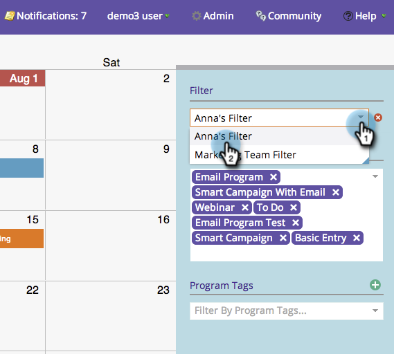
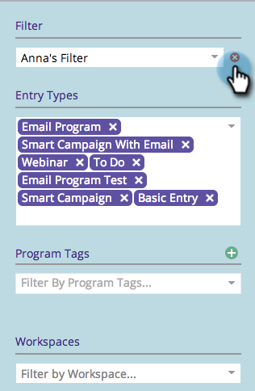

# Deleting a Filter in the Marketing Calendar {#deleting-a-filter-in-the-marketing-calendar}

1. Select the filter to delete.

   

1. Click the red **x**.

   

1. Click **[!UICONTROL Delete]** to confirm.

   
