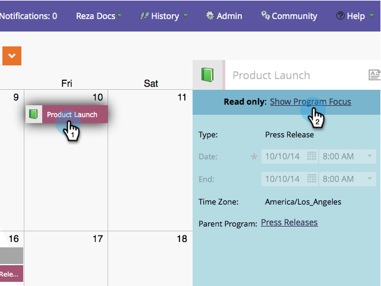
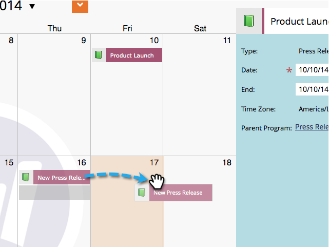
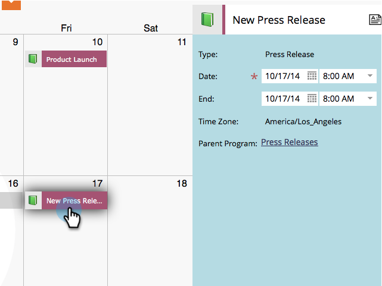
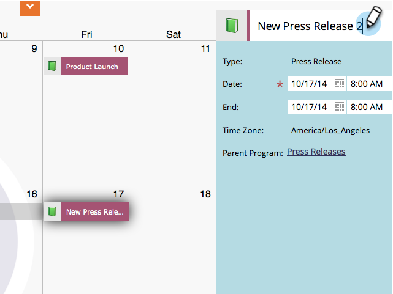
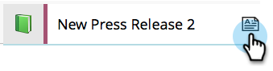
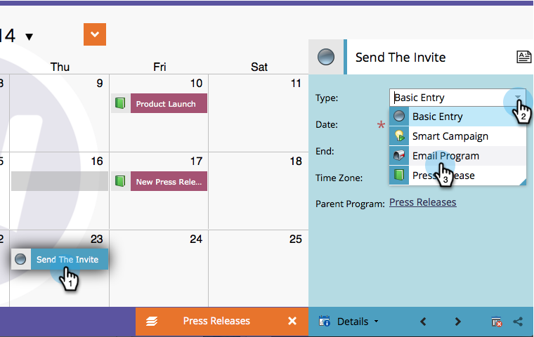

# Edit Entries Directly In the Marketing Calendar {#edit-entries-directly-in-the-marketing-calendar}

Once in program focus mode, you can quickly make changes to calendar entries. Here's how.

## Enable Program Focus {#enable-program-focus}

1. Click the **[!UICONTROL Calendar]** tile.

   

1. Select an entry that belongs to the program you want to focus on and click **[!UICONTROL Show Program Focus]**.

   

## Reschedule Entry {#reschedule-entry}

1. Simply drag and drop an entry to reschedule it.

   

## Edit Entry Name {#edit-entry-name}

1. Select the entry you want to rename.

   

1. Edit the entry name.

   

   >[!TIP]
   >
   >You can also edit the description.
   >
   >

## Convert Entry Type {#convert-entry-type}

After you have quickly penciled in your basic entries, you can convert them into their final form.

1. Find and select the basic entry you want to convert and change its type.

   

## Edit Entry Details {#edit-entry-details}

You can quickly get access to different areas of your entries for editing.

1. Right-click an entry and select the area that you want to edit.

   

That's it! As you can see there are a lot of things you can do directly from the Marketing Calendar.

>[!MORELIKETHIS]
>
>[Delete Entries Directly In the Marketing Calendar](/help/marketo/product-docs/core-marketo-concepts/marketing-calendar/working-with-the-calendar/delete-entries-directly-in-the-marketing-calendar.md){target="_blank"}
