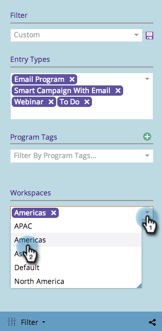

# Filtering the Marketing Calendar by Workspace {#filtering-the-marketing-calendar-by-workspace}

The Marketing Calendar can be filtered by objects in specific workspaces.

1. Go to the **Calendar**.

   

1. In the filter panel, select the **Workspace** drop-down. Choose your desired workspace.

   

   Great! You will now only see objects built in that particular workspace.

   >[!NOTE]
   >
   >[Saving a Filter Definition in the Marketing Calendar](/help/marketo/product-docs/core-marketo-concepts/marketing-calendar/working-with-the-calendar/saving-a-filter-definition-in-the-marketing-calendar.md)
