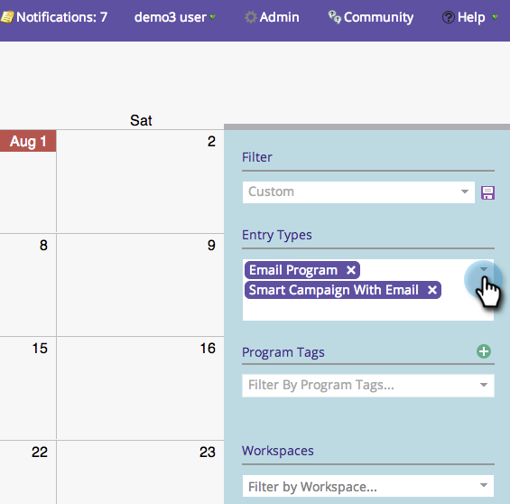
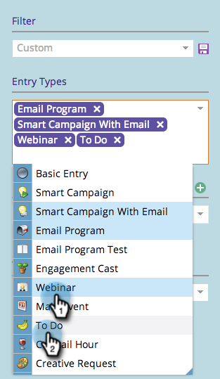
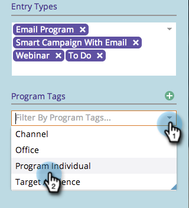
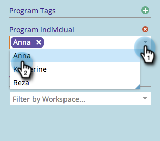

# Filtering the Marketing Calendar {#filtering-the-marketing-calendar}

Use entry types, program tags, or workspaces to filter the information displayed on the calendar.

1. Click the **[!UICONTROL Calendar]** tile.

1. Click the **[!UICONTROL Entry Type]** drop-down.

   >[!NOTE]
   >
   >The default entry types will be **[!UICONTROL Email]** **[!UICONTROL Programs]** and **[!UICONTROL Smart Campaigns with Email]**.

   

1. Choose additional entry types you'd like to see in your filter.

   

   >[!TIP]
   >
   >For descriptions of the standard entry types, check out [Program Schedule View Entry Types](/help/marketo/product-docs/core-marketo-concepts/programs/program-schedule-view/program-schedule-view-entry-types.md){target="_blank"}.

1. Select the program tags that interest you.

   

1. Select the tag value.

   

   Awesome! You will now only see entries that apply to the filter you just defined.

   >[!NOTE]
   >
   >[Saving a Filter Definition in the Marketing Calendar](/help/marketo/product-docs/core-marketo-concepts/marketing-calendar/working-with-the-calendar/saving-a-filter-definition-in-the-marketing-calendar.md){target="_blank"}
