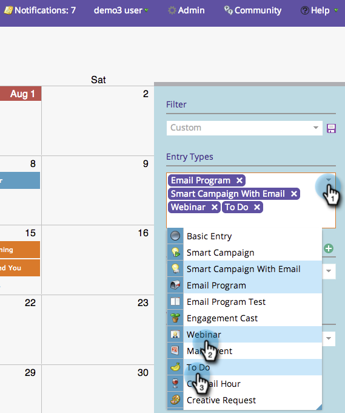
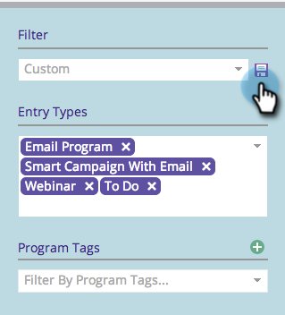
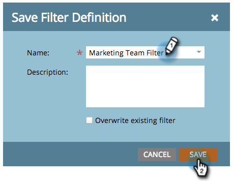
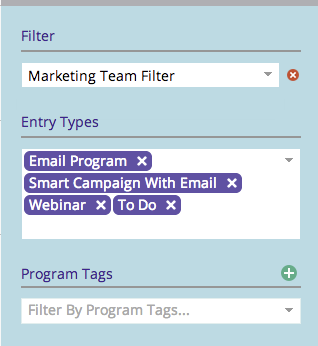

# Saving a Filter Definition in the Marketing Calendar {#saving-a-filter-definition-in-the-marketing-calendar}

Saving a filter lets you switch back and forth between different filter definitions.

>[!PREREQUISITES]
>
>[Filtering the Marketing Calendar](/help/marketo/product-docs/core-marketo-concepts/marketing-calendar/working-with-the-calendar/filtering-the-marketing-calendar.md)

1. Define the filter.

   

1. Click the save icon.

   

1. Name the filter. Click **[!UICONTROL Save]**.

   

   Rock on! The filter is now saved.

   

   If you want, you can [send a copy](/help/marketo/product-docs/core-marketo-concepts/marketing-calendar/working-with-the-calendar/sharing-a-filter-definition-in-the-marketing-calendar.md) of the definition to other Marketo users.

   >[!NOTE]
   >
   >[Sharing a Filter Definition in the Marketing Calendar](/help/marketo/product-docs/core-marketo-concepts/marketing-calendar/working-with-the-calendar/sharing-a-filter-definition-in-the-marketing-calendar.md)
