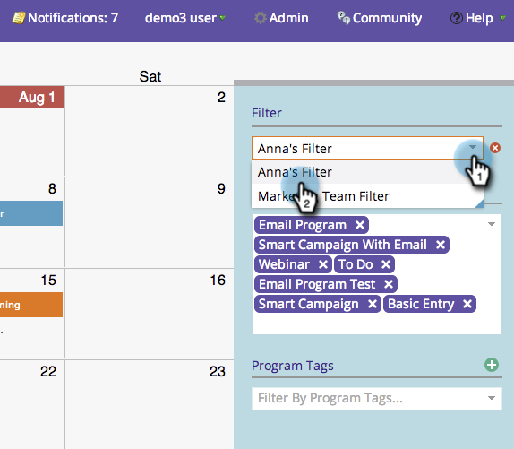
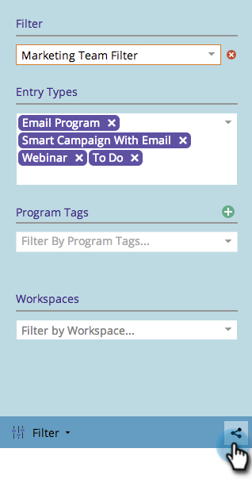

# Sharing a Filter Definition in the Marketing Calendar {#sharing-a-filter-definition-in-the-marketing-calendar}

Filters can be shared amongst different users.

>[!PREREQUISITES]
>
>* [Create a Filter in the Marketing Calendar](/help/marketo/product-docs/core-marketo-concepts/marketing-calendar/working-with-the-calendar/filtering-the-marketing-calendar.md)
>* [Saving a Filter Definition in the Marketing Calendar](/help/marketo/product-docs/core-marketo-concepts/marketing-calendar/working-with-the-calendar/saving-a-filter-definition-in-the-marketing-calendar.md)

>[!NOTE]
>
> If you make a change to a saved filter, be sure to re-share it; your edits will not be reflected for other users until you do.

1. Select the filter you'd like to share.

   

1. Click the share icon in the bottom right corner.

   

1. Copy the URL and share it with other Marketo users.

   

   >[!NOTE]
   >
   >User permissions will affect visibility.
