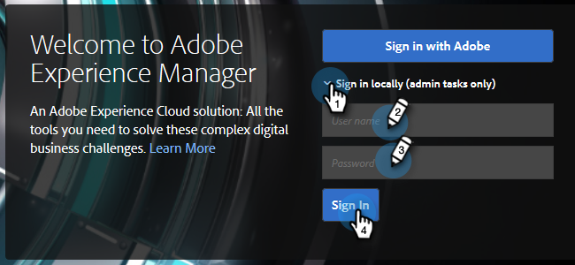
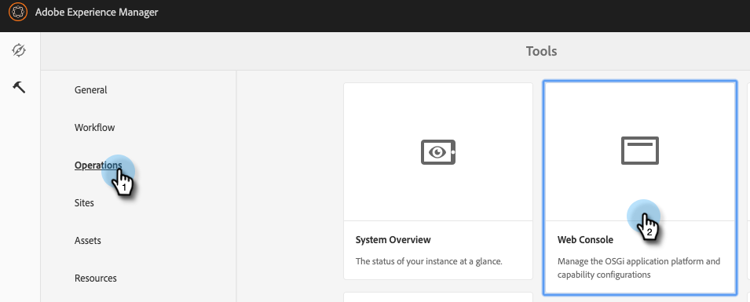
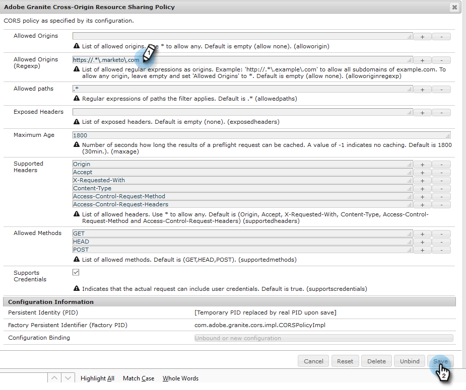
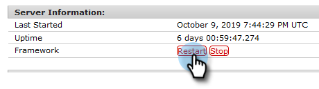
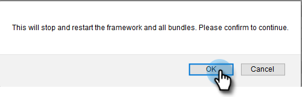

# Configuring Adobe Experience Manager Integration {#configuring-adobe-experience-manager-integration}

Configure Adobe Experience Manager (AEM) so you can access, select, and import AEM assets into the Marketo Engage Design Studio.

>[!NOTE]
>
>**Admin Permissions Required**

>[!IMPORTANT]
>
>* This integration only works with on-premise implementations of AEM and is not supported for AEM Cloud Service implementations.
>
>* Currently, this feature is only fully supported in Firefox. It is not supported in Safari, and it might not work in the latest version of Chrome, depending on your SameSite cookie settings.

1. Navigate to the Adobe Experience Manager (the URL is specific to your company).

   

1. You can sign in with Adobe or sign in locally. In this example, we'll sign in locally.

   

1. In **Tools**, click **Operations** and select **Web Console**.

   

1. In your browser, search (ctrl+f on Windows, cmd+f on Mac) for "Adobe Granite Cross-Origin Resource Sharing Policy."

   

1. Click the **+** sign on the right.

   

1. In the **Allowed Origins (Regexp)** text box, type in `https://.*\.marketo\.com` and click **Save**.

   

1. In the header at the top of the page, click **Web Console** and select **System Information**.

   

1. Under Server Information, click the **Restart** button.

   

1. Click **OK** to confirm.

   

1. In Marketo Engage, click **Admin**.

   

1. Under Integration, select **Adobe Experience Manager**.

   

1. Click **Edit**.

   

1. Enter your AEM URL and click **OK**.

   
