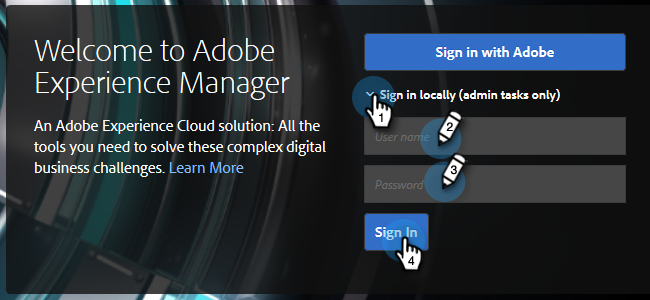
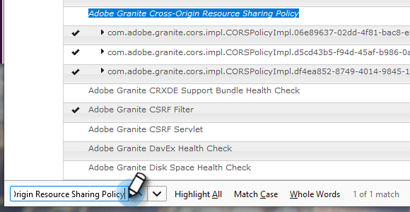
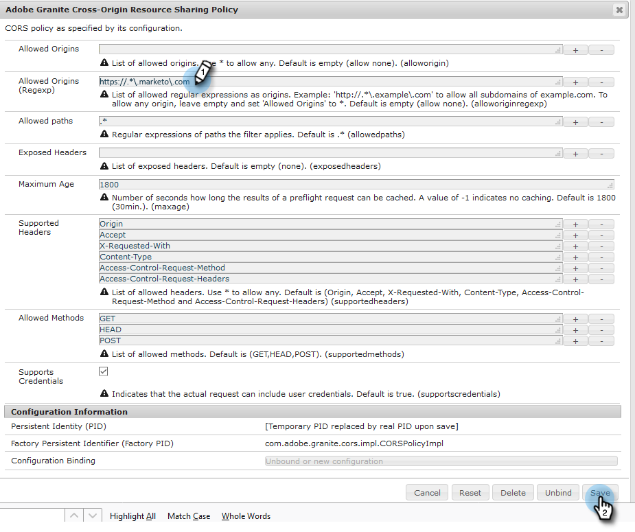
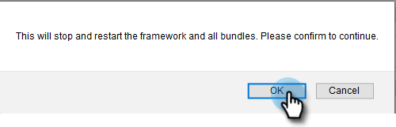

# Configuring Adobe Experience Manager Integration {#configuring-adobe-experience-manager-integration}

Configure Adobe Experience Manager (AEM) so you can access, select, and import AEM assets into the Marketo Engage Design Studio.

>[!NOTE]
>
>**Admin Permissions Required**

>[!IMPORTANT]
>
>* This integration only works with on-premise implementations of AEM and is not supported for AEM Cloud Service implementations.
>
>* Currently, this feature is only fully supported in Firefox. It is not supported in Safari, and it might not work in the latest version of Chrome, depending on your SameSite cookie settings.

1. Navigate to the Adobe Experience Manager (the URL is specific to your company).

   

1. You can sign in with Adobe or sign in locally. This example uses local sign-in.

   

1. In **[!UICONTROL Tools]**, click **[!UICONTROL Operations]** and select **[!UICONTROL Web Console]**.

   

1. In your browser, search (ctrl+f on Windows, cmd+f on Mac) for "[!UICONTROL Adobe Granite Cross-Origin Resource Sharing Policy]."

   

1. Click the **+** sign on the right.

   

1. In the **[!UICONTROL Allowed Origins (Regexp)]** text box, type in `https://.*\.marketo\.com` and click **[!UICONTROL Save]**.

   

1. In the header at the top of the page, click **[!UICONTROL Web Console]** and select **[!UICONTROL System Information]**.

   

1. Under Server Information, click the **[!UICONTROL Restart]** button.

   

1. Click **[!UICONTROL OK]** to confirm.

   

1. In Marketo Engage, click **[!UICONTROL Admin]**.

   

1. Under Integration, select **[!UICONTROL Adobe Experience Manager]**.

   

1. Click **[!UICONTROL Edit]**.

   

1. Enter your AEM URL and click **[!UICONTROL OK]**.

   
