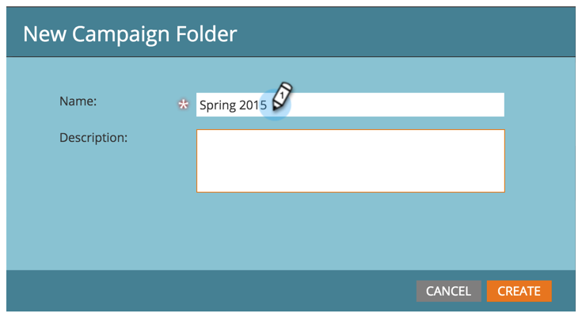
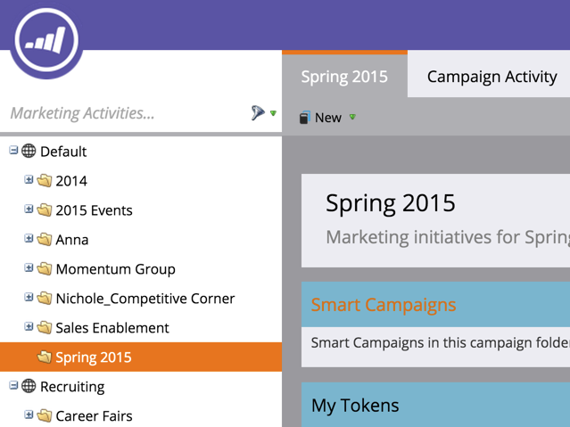

# Create New Campaign Folder {#create-new-campaign-folder}

Campaign folders help you keep a tidy workspace. Follow these simple steps and you're on your way to automation magic.

1. Go to **Marketing Activities**.

   

1. Select **New**.

   

1. Select **New Campaign Folder**.

   

1. Enter a **Name** for the campaign folder.

   

1. Optional: Enter a **Description** and click **Create**.

   >[!TIP]
   >
   >Descriptions are for other users on the subscription. Your customers will not see this message.

   

   Awesome! You just built a campaign folder. Check it out in the tree.

   

   Now when [creating a new program](/help/marketooduct-docs/core-marketo-concepts/programs/creating-programs/create-a-program.md), you'll see this campaign folder as an option.

>[!MORELIKETHIS]
>
>* [Create a Program](/help/marketooduct-docs/core-marketo-concepts/programs/creating-programs/create-a-program.md)
>* [Create a New Smart Campaign](/help/marketooduct-docs/core-marketo-concepts/smart-campaigns/creating-a-smart-campaign/create-a-new-smart-campaign.md)
