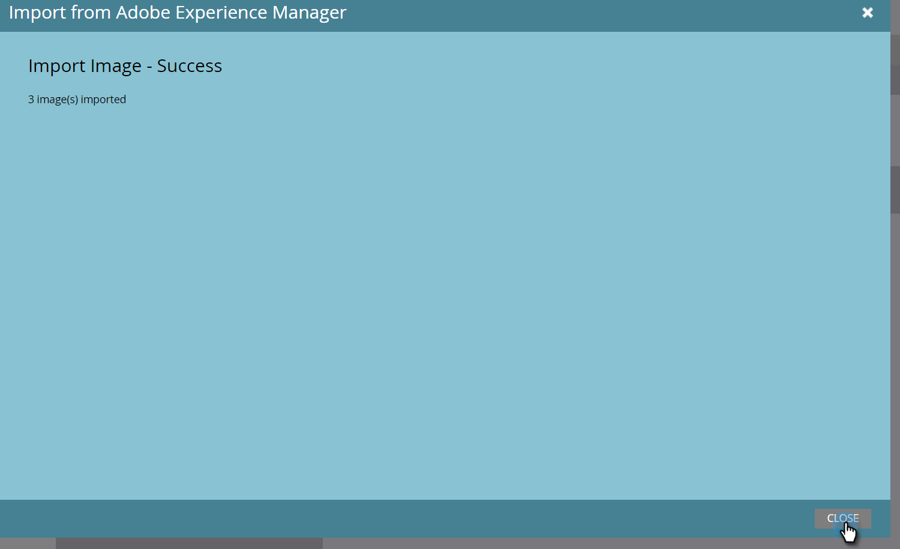

# Importing Assets with Adobe Experience Manager {#importing-assets-with-adobe-experience-manager}

The Asset Picker allows Marketo customers to access, select, and import AEM assets into Marketo's Design Studio. **Admin permissions are required**.

>[!AVAILABILITY]
>
>
>Not all customers have purchased this feature. Please contact your Customer Success Manager for details.

>[!PREREQUISITES]
>
>Make sure you've already performed the [AEM Configuration](/help/marketo/product-docs/core-marketo-concepts/miscellaneous/configuring-adobe-experience-manager-integration.md).

>[!CAUTION]
>
>Currently, this feature is only fully supported in Firefox. It is not supported in Safari, and it might not work in the latest version of Chrome (v. 80), depending on your SameSite cookie settings.

1. Click **Design Studio**.

   

1. Click the New drop-down and select **Import from Adobe Experience Manager**.

   

1. Choose the folder where your images will be saved to.

   

1. Log in to Adobe Experience Manager (if you haven't already).

   

1. Choose your folder. Then select your desired images by clicking on the thumbnail (you can choose up to 10). Click **Select** when done.

   

   >[!NOTE]
   >
   >Images cannot exceed 100MB in size.

1. Click **Import** to complete the process.

   

   And that's it! Click **Close** to return to the Design Studio.

   

## Things to Note {#things-to-note}

   Marketo currently supports Adobe Experience Manager versions 6.4 and 6.5.

   All users in your instance will be able to view/access the images you import.

   Images are not automatically updated. If an image you imported into the Marketo Design Studio is updated in AEM, you must manually re-import it into Marketo.
