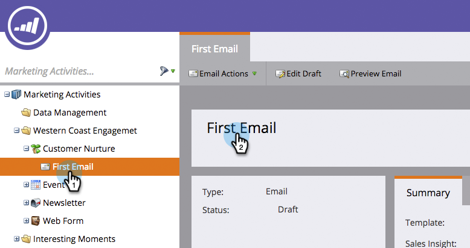
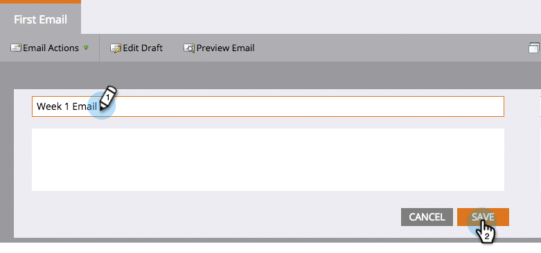

# Rename a Marketo Asset {#rename-a-marketo-asset}

Folders, programs, and local assets can all be easily renamed.

1. Select any asset you wish to rename and click the right-hand panel name block.

   

1. Type a new name within the text field. Click **Save**.

   

   >[!NOTE]
   >
   >You cannot rename files and images that have been uploaded, or an asset that's currently being referenced in a Smart List or Smart Campaign (in filters, triggers, flow steps, etc.).
