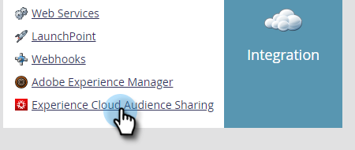
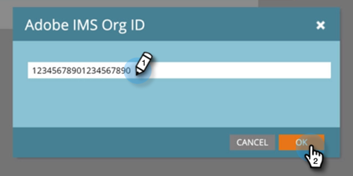
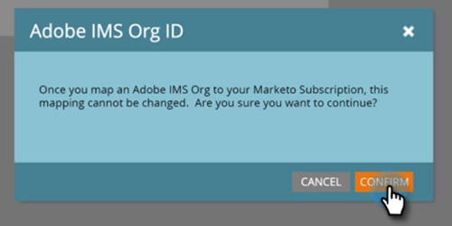

# Set Up Adobe Experience Cloud Audience Sharing {#set-up-adobe-experience-cloud-audience-sharing}

In order to share audience data to your Adobe applications, you must first enter your Adobe IMS Org credentials in Marketo. Here's how.

>[!NOTE]
>
>A HIPAA-ready deployment of a Marketo instance cannot use this integration.

1. In Marketo, click **Admin**.

   

1. Under Integration, click **Experience Cloud Audience Sharing**.

   

1. Click **Edit**.

   

1. Enter your Adobe IMS Org ID (learn how to find that [here](http://docs.adobe.com/content/help/en/control-panel/using/faq.html)) and click **OK**.

   

1. Click **Confirm**.

   

1. Click **Close**.

   

   >[!NOTE]
   >
   >For security reasons, you must be an Org Admin for the Adobe Organization that you want to map to. If you're not, the action will fail.

1. If you're *not* already logged in, a pop-up will appear in a new tab/window. Log-in to your Adobe org (this action validates the org access).

   And that's it! You can now begin [sharing audience data](http://docs.marketo.com/x/ogI6Ag).

