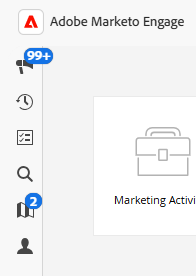
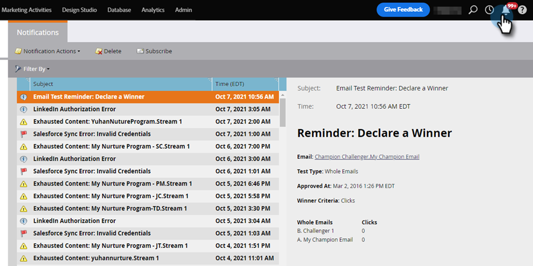
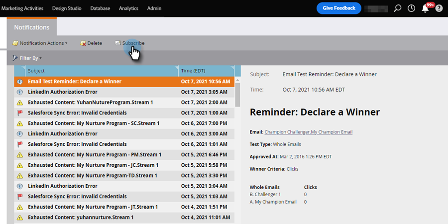
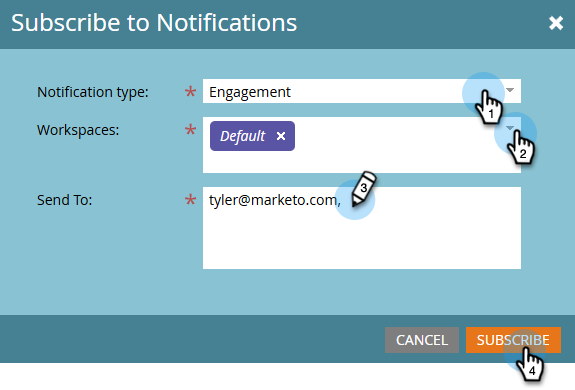

# Understanding Notifications {#understanding-notifications}

Notifications keep you up-to-date on system events happening in your Marketo subscription. For example, Campaign failure notifications inform you about errors in your smart campaigns, and CRM sync notifications alert you to critical issues found with the CRM sync, such as incorrect permissions or the sync being down.

## Overview {#overview}

1. New notifications appear on the top right of Marketo.

   

1. Click Notifications to view all your notifications.

   

## Subscribe to Notifications {#subscribe-to-notifications}

You can subscribe to notifications to receive them in your email.

1. Go to [!UICONTROL Notifications] and click **[!UICONTROL Subscribe]**.

   

1. Select the [!UICONTROL Notification Type] and enter the email address(es) you want notifications sent to (separated by a comma). Click **[!UICONTROL Subscribe]** when done.

   

>[!NOTE]
>
>The **[!UICONTROL Send To]** area is only for you to enter your email, it will not show a list of existing subscribers.

In some cases, a notification provides a "See the full list" link to download a comma-separated-value (CSV) file, for example, the Microsoft Dynamics Sync Errors file. Marketo retains these CSV files for 30 days. If you attempt to download the file after 30 days, you'll get a 404 error.

>[!TIP]
>
>Want to unsubscribe from notification emails? No problem. Simply click the **unsubscribe from Notifications** link at the bottom of the email.
