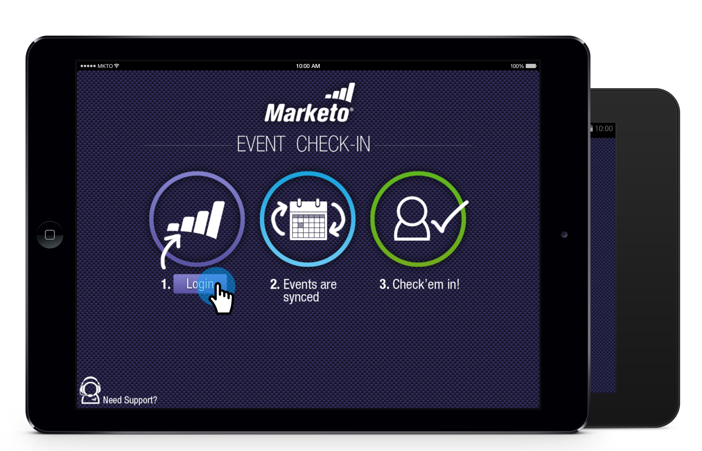
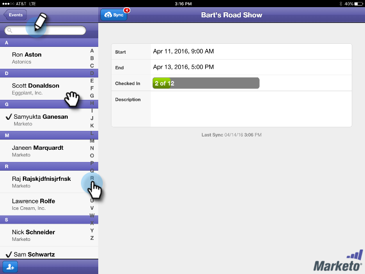
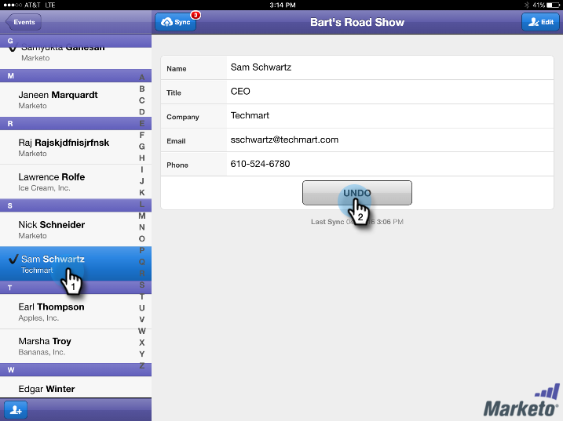
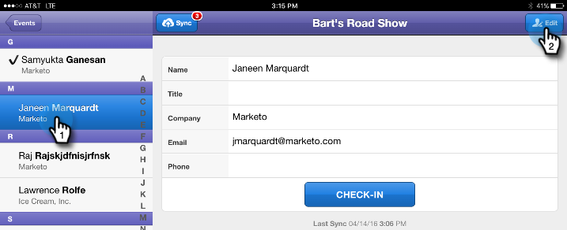

# Check People into Your Event from Your Tablet {#check-people-into-your-event-from-your-tablet}

When people show up at your event, you can find their information on the app. After check-in, they're promoted to Attended status when you sync to Marketo.

The app works the same on both iPad and Android, except for minor layout and design differences.

>[!PREREQUISITES]
>
>* Create an event in Marketo and populate it with Invited and Registered people.
>* Download the tablet app for [Android](https://play.google.com/store/apps/details?id=com.marketo.eventcheckin&hl=en) or [iOS](https://itunes.apple.com/us/app/marketo-events/id522766637?mt=8)

## Check in Registered Guests {#check-in-registered-guests}

1. Tap the app icon on your iPad or Android tablet.

1. Tap **Login** to launch the Marketo Event app.

   

1. Enter your Marketo username and password and click **Login**.

   >[!NOTE]
   >
   >You must have a role with access to the Database to see people in the app.

1. Select an **Event**.

   

   >[!TIP]
   >
   >Only event programs (with the exception of webinars) scheduled one week before and one week after today's date are displayed.

1. On the Home screen, browse to find Registered guests. To find a person in the list, you can:

    * Scroll to find a name
    * Enter a name in the search field
    * Jump to a specific initial letter of the last name by tapping it on the right side of the list

   >[!NOTE]
   >
   >The process is the same on iPad and Android, but the screens differ, and items may be in different locations. This article features the iPad interface. Compare the Android screen in this section for reference.

   **iPad** 

   

   **Android**

   

1. Tap the selected name, and on the person record, tap **Check-in**.

   

The guest now has an Attended status, and receives a check mark. The person record is updated when you sync with Marketo. The red counter on the Sync button increments to show the number of check-ins since the last sync with Marketo. The Sync button looks different and is in a different location for iPad and Android:

**iPad**

**Android**

>[!TIP]
>
>If a person is invited but hasn't registered, you can search for the name by clicking **Search on Server**, just below the Search box. The Invited status changes to **Attended** for the event.

## Create a New Person on the Tablet {#create-a-new-person-on-the-tablet}

You can manually add guests who aren't existing people in your Marketo database. They'll be automatically checked in and added to your Database when you sync with Marketo.

1. Click **Add**.

   **iPad**

   

   **Android**

   

1. Complete as many of the basic information fields as you can and tap **Done**.

   

   >[!NOTE]
   >
   >You can only use the existing fields. You can't create custom ones.

   >[!CAUTION]
   >
   >Double-check the email address. Other fields can be corrected later, but the email address is the primary method for contacting the guest.

The new person is registered as checked in to your event, and will be added to the Marketo database with Attended status when you sync to Marketo.

## Reverse a Check-In {#reverse-a-check-in}

If you checked in a person by mistake, _before you synced with Marketo_, you can reverse the Attended status.

1. Tap the name in the list, and in the person record, tap **Undo**.

   

   All fixed!

## Edit a Person Record at Check-In {#edit-a-person-record-at-check-in}

You can add and modify guest information, right at the event!

1. Tap the name in the people list and tap **Edit**.

   

1. Edit and add information to the fields, then tap **Done**.

   

   >[!NOTE]
   >
   >In Android, the **Done** button may be hidden. Scroll down to find it.

The information will be updated when you sync the app with Marketo.

## Sync the App with Marketo {#sync-the-app-with-marketo}

The Marketo Events app works independently until you sync your activity back to the Marketo Database. It's best to sync as soon as possible after the last check-in. Your tablet must be connected to the Internet.

>[!CAUTION]
>
>After you sync, you can't reverse a check-in from the app.

1. On your tablet, open the app and navigate to your event.

1. Tap **Sync**.

   Your event is updated with new check-ins in the Marketo database. The red counter on the Sync button clears, until you check someone else in.

   For security reasons, you should quit the Marketo Events app after you're done syncing.

## Working with Limited Internet Access {#working-with-limited-internet-access}

Some venues have lousy Internet access. You need a good connection to:

* Download and install the app
* Log in
* Select an event
* Sync the app with Marketo

If you're concerned about Internet access at the venue, you may want to log in to the Marketo Events app and select your event in advance, at a location with strong Internet access. That way, you still can use the app offline. Then, when you regain an Internet connection, sync right away to the Marketo database.

>[!TIP]
>
>If you don't have an Internet connection, you still can create a new person for a person checking in. It'll reconcile with the existing person when you sync the app.

>[!NOTE]
>
>The app automatically logs you out after eight hours of inactivity.
