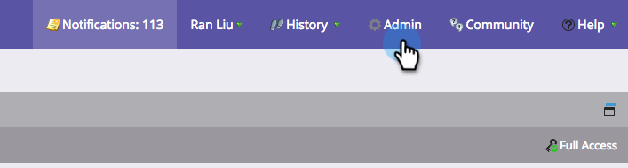
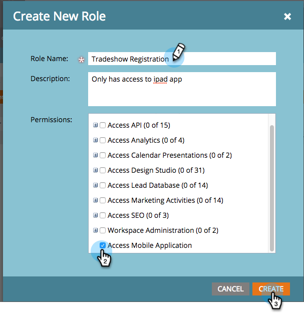
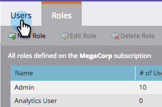
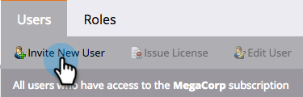
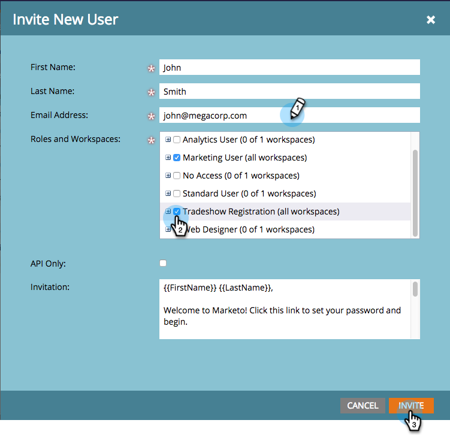

# Grant Users Access to the Check-in App {#grant-users-access-to-the-check-in-app}

Marketo has a special user role for the event check-in app. Here's how to create a new role with permission to use the app.

##

#### Create a New User Role for Mobile {#create-a-new-user-role-for-mobile}

1. Click **Admin**.

   

1. Click **Users & Roles**.

   

1. Click the **Roles** tab, then click **New Role**.

   

1. Enter a name for the new role and an optional description. Check the **Access Mobile Application** box and click **Create**.

   

   The new role is ready to assign when you invite people to use the tablet app.

## Invite New Users for the Check-in App {#invite-new-users-for-the-check-in-app}

1. Click the **Users** tab.

   

1. Click** Invite New User**.

   

1. Enter the information of the new user. Select the checkboxes for all appropriate roles and the new role with the permission to access the mobile app. Click **Invite** when you're done.

   

   >[!CAUTION]
   >
   >Users who don't have access to the Database can't see any people in the app.

   >[!TIP]
   >
   >For existing users, you may either create a new role or add the Access Mobile Application permission to the current role.

The user will receive an email telling them they have access to the check-in app. 