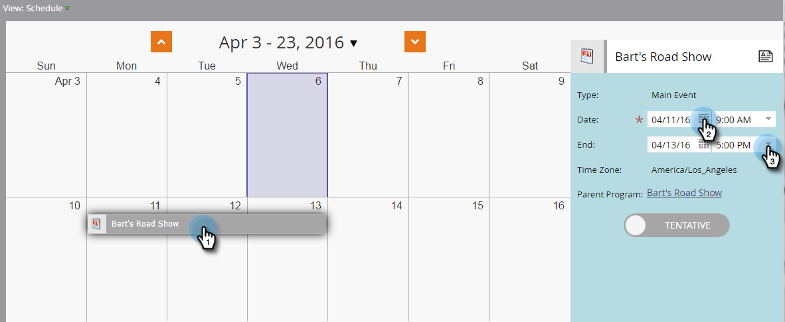
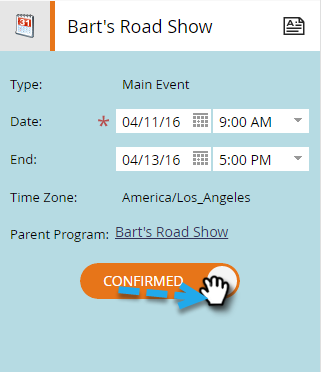
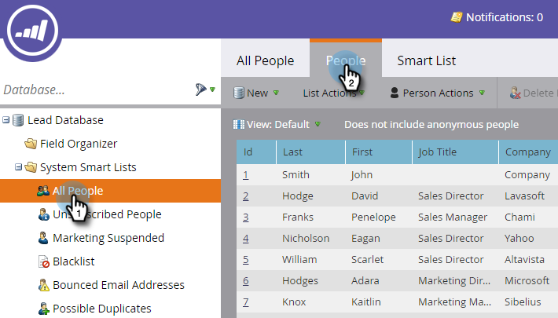
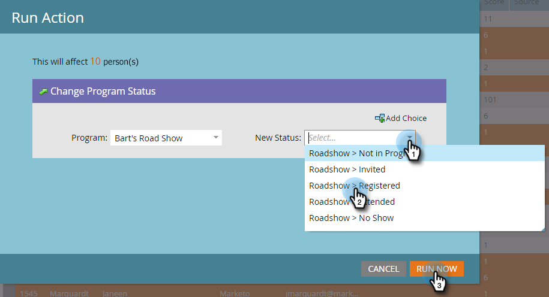
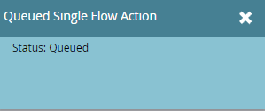

# Prepare for Your Event {#prepare-for-your-event}

There are several things you have to do to get ready for the event.

>[!NOTE]
>
>**FYI**
>
>Marketo is now standardizing language across all subscriptions, so you may see lead/leads in your subscription and person/people in docs.marketo.com. These terms mean the same thing; it does not affect article instructions. There are some other changes, too. [Learn more](http://docs.marketo.com/display/DOCS/Updates+to+Marketo+Terminology).

## Create a New Marketo Role {#create-a-new-marketo-role}

Marketo has a special user role for the event check-in app.  [Create a new Marketo role](https://docs.marketo.com/display/DOCS/Grant+User+Access+to+the+Check-in+App) for iPad or Android users, with permission to access the mobile application.

## Invite New Tablet Users to the Event {#invite-new-tablet-users-to-the-event}

[Invite new tablet users to the event](https://docs.marketo.com/display/DOCS/Grant+User+Access+to+the+Check-in+App) and assign them the new role.

## Create a New Marketo Event Program {#create-a-new-marketo-event-program}

[Create a new Marketo event program](../../../../product-docs/demand-generation/events/understanding-events/create-a-new-event-program.md) to capture the status of your people as they progress through different stages and get accurate measures of the ROI for your marketing initiatives. 

## Specify the Event Dates {#specify-the-event-dates}

It's a snap to set your event dates.

1. Click the event on the schedule and set the start and end date and time.

   

1. Slide over to change **Tentative** to **Confirmed**.

   

   >[!CAUTION]
   >
   >If the date of the Event is more than one week before or after the current date, your event will not appear in the app. **Tip**: To test it, temporarily set the dates to within one week of today. Remember to return the event to the correct dates after you test it.

## Add People to Your Event {#add-people-to-your-event}

Now that you know the *when*, it's time to add the *who*.

1. If you already have a list of people, in My Marketo, click the **Database** tile.

   

1. Select a list with people and click the **People** tab.

   

1. Select the people for your event from the list. Use **Ctrl** (or **Command** on a Mac) to click on multiple people, or **Select All** to mark all of them.

   

1. Click **Person Actions**, hover over** Programs** and select **Change Program Status**.

   

1. Click the **Program** drop-down list and select your event.

   

1. Click the **New Status** drop-down and select **Roadshow > Registered**. Click **Run Now**.

   

1. A small window displays progress...

   

1. ...and indicates when the task is complete. 

   

   The selected people are now in your event, ready to be checked in using the tablet app on the trade show floor.

