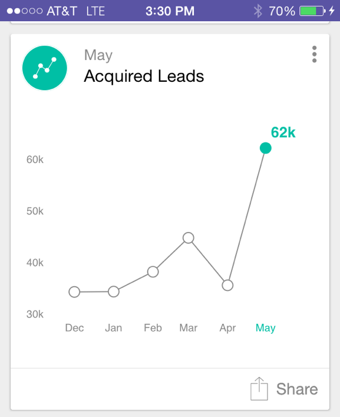

# Understanding Analytics Cards {#understanding-analytics-cards}

At the beginning of each month, Marketo Moments provides three different report cards: Acquired Leads, New Leads, and Unsubscribes. Each one shows you monthly performance and the trend over a six-month period.

## Analytics Cards {#analytics-cards}

When you tap an Analytics card you can:

* [Make it a favorite](/help/marketo/product-docs/core-marketo-concepts/mobile-apps/marketo-moments/working-with-moments/creating-a-favorite.md)
* [Mark it as done](/help/marketo/product-docs/core-marketo-concepts/mobile-apps/marketo-moments/working-with-moments/marking-it-done.md)
* [Share it](/help/marketo/product-docs/core-marketo-concepts/mobile-apps/marketo-moments/working-with-moments/sharing-a-moment.md)

Tap an Analytics card to show:

* A graph for the last six months' results
* A month-over month comparison
* A bar chart of the most or top three (depending on the card)

For example, let's take a look at the details for the Acquired Leads Analytics card:

In this example, red indicates the value has decreased over the selected date range (uh oh!). Green indicates the value has increased (yay!).

## Acquired Leads {#acquired-leads}

The **Acquired Leads** card shows you a trending month-over-month report of the number of new leads.

>[!NOTE]
>
>Only leads with an defined acquisition program are visible.

## New Leads {#new-leads}

The **New Leads** card shows you a trending month-over-month report of the total number of new leads in your instance over the last six months.

## Unsubscribes {#unsubscribes}

The **Unsubscribes** card shows you a month-over-month trending report of your unsubscribe rate over the last six months.

Now you know.

>[!MORELIKETHIS]
>
>* [Understanding Marketo Moments](/help/marketo/product-docs/core-marketo-concepts/mobile-apps/marketo-moments/understanding-moments/understanding-marketo-moments.md)
>* [Understanding Event Cards](/help/marketo/product-docs/core-marketo-concepts/mobile-apps/marketo-moments/understanding-moments/understanding-event-cards.md)
>* [Understanding Email Program Cards](/help/marketo/product-docs/core-marketo-concepts/mobile-apps/marketo-moments/understanding-moments/understanding-email-program-cards.md)
