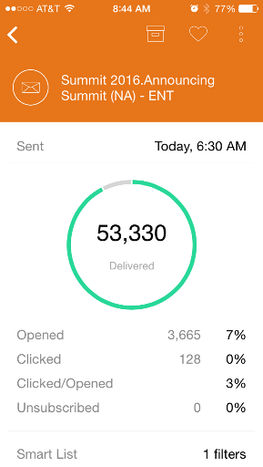
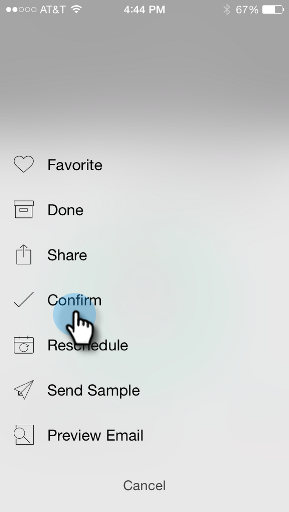
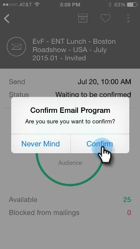
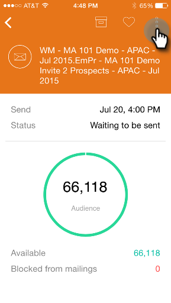
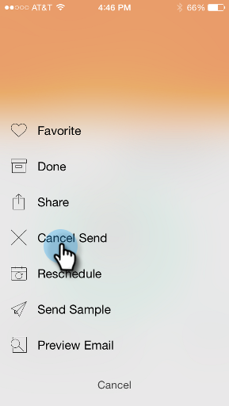
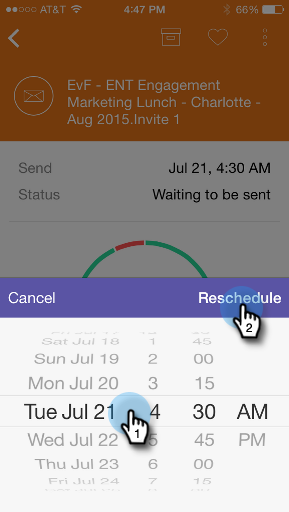
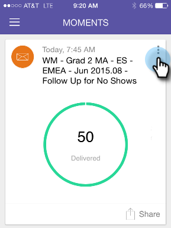
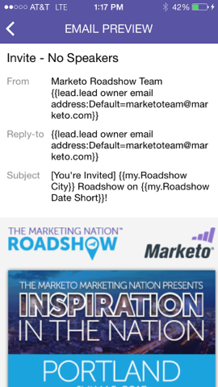

# Understanding Email Program Cards {#understanding-email-program-cards}

Use Marketo Moments to view your Email Programs from your phone or iPad.

>[!IMPORTANT]
>
>On October 2, 2023, Adobe removed the Marketo Moments App from all App Stores. If you already have the app installed on your tablet/mobile device, you can continue using it for the time being. Once your Marketo Engage instance is migrated to Adobe Identity for authentication of Marketo, you will no longer be able to access the app. [Learn more](https://nation.marketo.com/t5/product-discussions/marketo-events-app-and-marketo-moments-app-end-of-life/m-p/340712/highlight/true#M193869){target="_blank"}.

## Email Program Cards {#email-program-cards}

When you tap any Email Program card you can:

* [Make an email a favorite](/help/marketo/product-docs/core-marketo-concepts/mobile-apps/marketo-moments/working-with-moments/creating-a-favorite.md)
* [Mark an email as done](/help/marketo/product-docs/core-marketo-concepts/mobile-apps/marketo-moments/working-with-moments/marking-it-done.md)
* [Share an email moment card](/help/marketo/product-docs/core-marketo-concepts/mobile-apps/marketo-moments/working-with-moments/sharing-a-moment.md)

On an email program card for an email that's not sent yet, you'll find information about that email program's status and audience.

After the email has been sent, the card displays other valuable information, including the number of delivered emails, the recipients' actions, and a link to the smart list used in the campaign.

## Confirming an Email Card {#confirming-an-email-card}

1. To confirm an unconfirmed email card, tap the three dot menu.

   

1. Tap **[!UICONTROL Confirm]**.

   

1. Tap **[!UICONTROL Confirm]** to finish the job, or **[!UICONTROL Never Mind]** if you had second thoughts.

   

   >[!NOTE]
   >
   >Now your card will turn to orange!

## Canceling an Email Card Send {#canceling-an-email-card-send}

1. If you decide not to send your confirmed email out, tap the three dot menu.

   

1. Tap **[!UICONTROL Cancel Send]**.

   

## Rescheduling an Email Card {#rescheduling-an-email-card}

You can reschedule confirmed or unconfirmed email cards.

>[!NOTE]
>
>For emails that are already confirmed, you have to cancel the email first (see below).

1. To reschedule an email, tap the three dot menu.

   

1. Tap **[!UICONTROL Reschedule]**.

   

1. Select a date on the calendar and tap **[!UICONTROL Reschedule]**.

   

   As long as you've got wireless service, you can reschedule from anywhere!

## Sending a Sample {#sending-a-sample}

You can share a sample of an email moment directly with someone.

1. Open the Card Menu.

   

1. Tap **[!UICONTROL Send Sample]**.

   

1. Enter an email address and click **[!UICONTROL Send Sample]**.

   

## Previewing an Email {#previewing-an-email}

Right click on an email card to preview it.

1. Tap **[!UICONTROL Preview Email]**.

   

   This way, you know your email's perfect before you pull the trigger!

   

>[!MORELIKETHIS]
>
>* [Understanding Marketo Moments](/help/marketo/product-docs/core-marketo-concepts/mobile-apps/marketo-moments/understanding-moments/understanding-marketo-moments.md)
>* [Understanding Event Cards](/help/marketo/product-docs/core-marketo-concepts/mobile-apps/marketo-moments/understanding-moments/understanding-event-cards.md)
>* [Understanding Analytics Cards](/help/marketo/product-docs/core-marketo-concepts/mobile-apps/marketo-moments/understanding-moments/understanding-analytics-cards.md)
