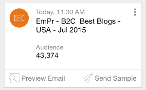
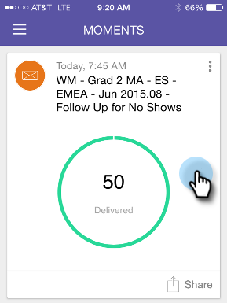
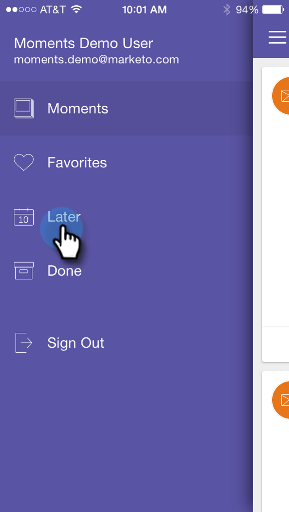
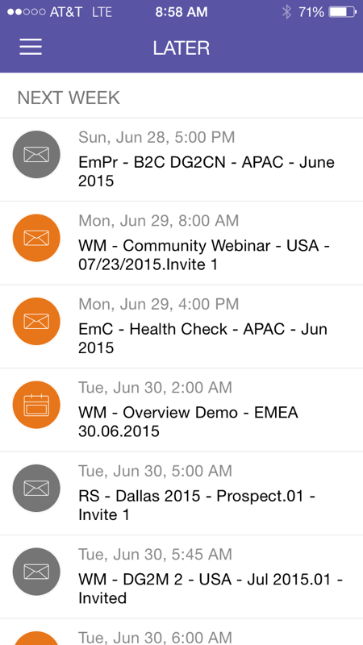
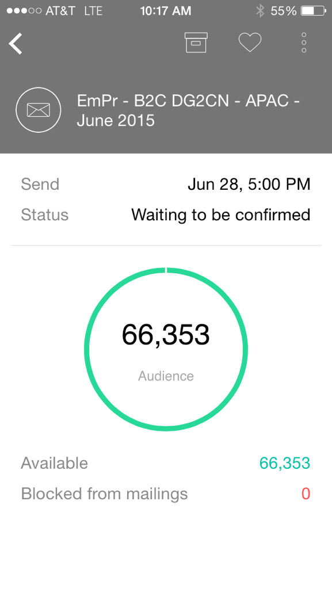
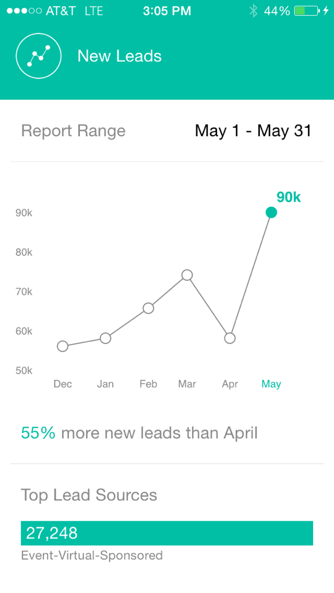

# Understanding Marketo Moments {#understanding-marketo-moments}

The power of Marketo is now in your hands, literally! Preview and reschedule emails right from your phone or iPad.

>[!NOTE]
>
>**Availability**
>
>Access Mobile Apps permission is required. Contact your Marketo Admin to [update your role](../../../../../product-docs/administration/users-and-roles/managing-user-roles-and-permissions.md).

## Introducing Moments {#introducing-moments}

`<iframe width="420" height="315" src="https://www.youtube-nocookie.com/embed/IJfpzE8l73E" frameborder="0" allowfullscreen></iframe>` 

## Streams {#streams}

Here are the different streams in Moments. 

>[!NOTE]
>
>**Definition**
>
>Moments- Anything that just ran, or is about to run goes here.
>
>Favorites - Anything you make a favorite goes in here. 
>
>Later - Anything taking place later than this moment goes in here.
>
>Done - Anything that finished running or you marked as done goes here.

OK, now that we've got that out of the way, let's take a peek at Marketo Moments on a phone!

## Three Kinds of Cards {#three-kinds-of-cards}

Marketo Moments gives you three different cards to follow the progress of your email:

**On-Deck** - This email is about to go out. It's your last chance to preview it, send a sample or, even cancel it if you have to.

**heart-beat** - Hey - this email is being delivered now! And here are stats, too. Go ahead and share it.

**Results** - Here's how the email did. After the email finishes running, the Results card displays the engagement score and other stats. 

## Moments Stream {#moments-stream}

When you first open the app or tap **Moments** in the menu, relevant cards show first. Each one contains information about that specific marketing initiative and its overall performance.

Tapping the card opens a detail screen.

>[!NOTE]
>
>Orange cards are confirmed; gray ones are tentative.

Tapping the three dots opens a card action menu.

Great! Now, you can make something happen by tapping:

>[!NOTE]
>
>**Definition**
>
>* Favorite: It's easy to pay attention to the stuff that's most timely and important if you make them favorites.
>* Done: Done gets it off your Marketo Moments view (but leaves it in Marketo, safe and sound). 
>* Share: Send an image to motivate or congratulate your team.
>* Send Sample (email only): Use this to let others check out how your emails look before you send them out.
>* Preview Email (emails only): It's always a good idea to check out your emails in advance.
>

## Later Moments {#later-moments}

The Later section shows upcoming activities.

1. Start by tapping the hamburger menu.

   >[!NOTE]
   >
   >According to the [Guinness Book of World Records](http://www.guinnessworldrecords.com/world-records/largest-hamburger), the world's largest hamburger weighed 2,014 lbs.

   

1. Tap **Later**.

   

   See a list of upcoming activities.

   

## Email Program Cards {#email-program-cards}

Email program cards show important stuff like schedule, audience, status, and other useful things, even when you're out at lunch.

## Event Cards {#event-cards}

For events, you'll see the total number of members and their status.

## Analytics Cards {#analytics-cards}

Analytics Moment cards show you how your emails and events are performing month-to-month for the last six months, for:

1. Acquired Leads
1. New Leads
1. Unsubscribes

## Smart Campaign Run Cards {#smart-campaign-run-cards}

Smart campaign cards represent a single run of a  campaign. A new card appears each time the smart campaign runs. Tap to see the smart list filters used, the campaign flow, and each of the emails used in the campaign. 

## Confirm or Cancel an Action {#confirm-or-cancel-an-action}

Every step of the way, you can confirm or cancel an action. If you change your mind, just tap **Never Mind**.

Ready to learn more?

>[!NOTE]
>
>**Related Articles**
>
>* [Understanding Email Program Cards](understanding-email-program-cards.md)
>* [Understanding Event Cards](understanding-event-cards.md)
>* [Understanding Analytics Cards](understanding-analytics-cards.md)
>* [Understanding Smart Campaign Cards](understanding-smart-campaign-cards.md)
>

## Supported Versions  {#supported-versions}

Marketo Moments supports these operating system versions:

* Apple iOS 8.0 and higher.
* Android version 4.1 and higher (basically Jellybean and up).

