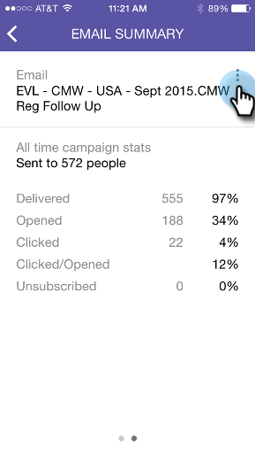

# Understanding Smart Campaign Cards {#understanding-smart-campaign-cards}

Use Marketo Moments to view each run of your Smart Campaigns from your smart phone or iPad. The Marketo Moments Smart Campaign card represents a single run of a  campaign; a new card appears each time the Smart Campaign runs. Smart Campaign cards are marked with a light bulb at the upper left.

>[!IMPORTANT]
>
>On October 2, 2023, Adobe removed the Marketo Moments App from all App Stores. If you already have the app installed on your tablet/mobile device, you can continue using it for the time being. Once your Marketo Engage instance is migrated to Adobe Identity for authentication of Marketo, you will no longer be able to access the app. [Learn more](https://nation.marketo.com/t5/product-discussions/marketo-events-app-and-marketo-moments-app-end-of-life/m-p/340712/highlight/true#M193869){target="_blank"}.

For future Smart Campaigns that are scheduled but have not yet run, the Marketo Moments card doesn't display any campaign stats yet. They'll appear in a future release.

## Smart Campaign Cards {#smart-campaign-cards}

1. Tap the card to open the details card.

   

1. The details card gives you access to information on the Smart List filters, Flow, and Email Summary.

1. Tap **Smart List**.

   

1. The filters used by the smart list are shown here.

   

1. Tap **Flow**.

   

1. Now, you'll see the flow of the Smart Campaign. This campaign has only one flow step, but there can be multiple ones.

   

1. Click **Email Summary**.

   

1. Now, you can see recipient response to each email, by number and percentage.

   

1. See those two dots at the bottom? They indicate that there are two emails connected to this Smart Campaign. To view results for the other email, swipe the screen to the left. Here are the results for the second email.

   

   >[!NOTE]
   >
   >Notice that the other dot is highlighted now.

## Creating Email Samples and Previews {#creating-email-samples-and-previews}

It's a good idea to get a look at an email before it goes out. Or, send a sample to someone else to get a second set of eyes on it.

1. Tap the three-dot action menu on an email.

   

1. Tap [Send Sample](/help/marketo/product-docs/core-marketo-concepts/mobile-apps/marketo-moments/working-with-moments/sending-a-sample.md) or [Preview Email](/help/marketo/product-docs/core-marketo-concepts/mobile-apps/marketo-moments/working-with-moments/previewing-an-email.md) (click these links for details).

   

## Confirming a Smart Campaign Run {#confirming-a-smart-campaign-run}

Cards for unconfirmed Smart Campaigns are gray until you confirm them. Then, they turn orange.

1. To confirm an unconfirmed Smart Campaign card, tap the three dot action menu.

   

1. Tap **Confirm**.

   

1. Tap **Confirm** to finish the job, or **Never Mind** if you have second thoughts.

   

   >[!NOTE]
   >
   >Now your card will turn to orange!

## Canceling a Smart Campaign Run {#canceling-a-smart-campaign-run}

You can cancel a confirmed, scheduled Smart Campaign run.

1. Tap the three dot action menu.

   

1. Tap **Cancel Run**.

   

1. Tap **Cancel Run**. If you decide at the last minute not to cancel the run, tap **Never Mind**, and the Smart Campaign will run as scheduled.

   

## Rescheduling a Smart Campaign {#rescheduling-a-smart-campaign}

You can reschedule a confirmed Smart Campaign that hasn't run yet.

1. Tap the three dot action menu.

   

1. Tap **Reschedule**.

   

1. Select a date on the calendar and tap **Reschedule**.

   

   Piece of cake!

## Other Smart Campaign Actions {#other-smart-campaign-actions}

As with other Marketo Moments cards, you can tap the three dots on any Smart Campaign card or details card to:

* [Make it a favorite](/help/marketo/product-docs/core-marketo-concepts/mobile-apps/marketo-moments/working-with-moments/creating-a-favorite.md)
* [Mark it done](/help/marketo/product-docs/core-marketo-concepts/mobile-apps/marketo-moments/working-with-moments/marking-it-done.md)
* [Share it](/help/marketo/product-docs/core-marketo-concepts/mobile-apps/marketo-moments/working-with-moments/sharing-a-moment.md)

>[!NOTE]
>
>You can also tap the **Share** icon on a Smart Campaign card to share, and the **Done** and **Favorite** icons on the details card.

## Quickly Delete a Smart Campaign Card {#quickly-delete-a-smart-campaign-card}

If you have a card that you no longer need, perhaps one you used for testing, you can get rid of it with a quick swipe left or right.
