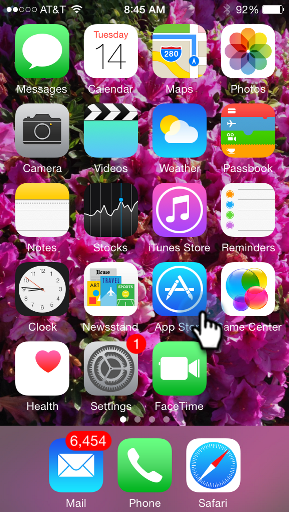
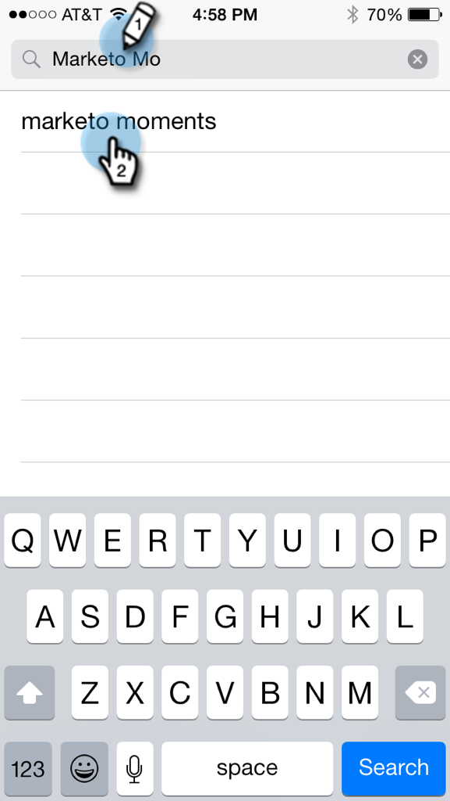
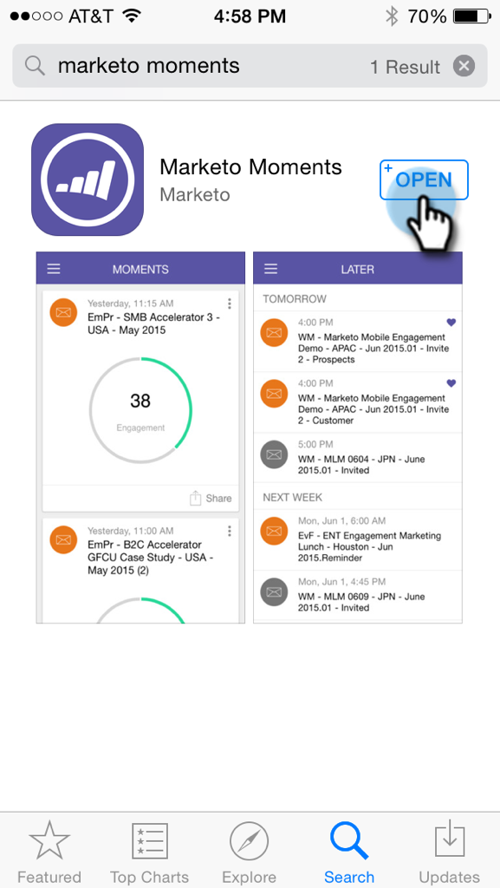
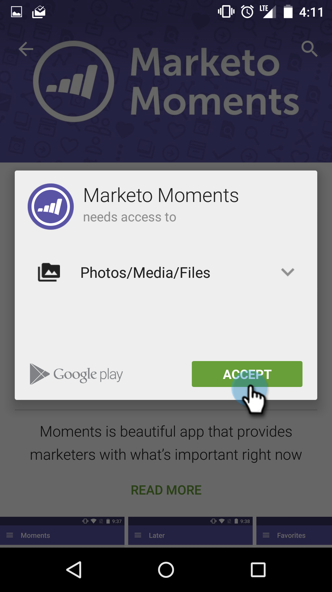

# Downloading Marketo Moments {#downloading-marketo-moments}

Downloading Marketo Moments - Marketo Docs - Product Documentation

Download Marketo Moments from the App Store or Google Play and voila! Marketo magic in the palm of your hand.

### What's in this article? {#whats-in-this-article}

[For iPhone](#for-iphone)  
[For Android](#for-android)

#### For iPhone {#for-iphone}

1. Go to the [App Store](https://itunes.apple.com/us/genre/ios/id36?mt=8).   
   

1. Search for Marketo Moments and select it.   
   

1. Then, tap **Open**.   
   

#### For Android {#for-android}

1. Go to [Google Play](https://play.google.com/store?hl=en).
1. Search for Marketo Moments and tap to download.&nbsp;  
   

1. Tap&nbsp;**Accept**.  
   

1. Tap&nbsp;**Install**.  
   

Enjoy!

>[!NOTE]
>
>Log in with your normal Marketo login and password.
>
>Single sign-on with Security Assertion Markup Language (SAML) is not supported for Marketo Moments.

>[!NOTE]
>
>**Related Articles**
>
>[Understanding Marketo Moments](../../../../../product-docs/core-marketo-concepts/mobile-apps/marketo-moments/understanding-moments/understanding-marketo-moments.md)

