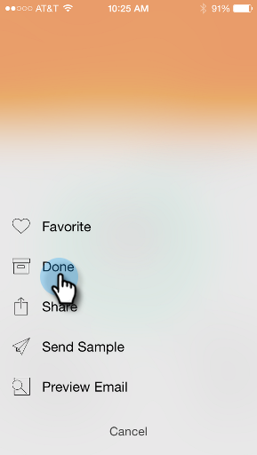

# Marking it Done {#marking-it-done}

Mark an email program, event, or analytics card as Done to remove it from your stream. There are two ways to do it.

1. Tap the action menu.

   

1. Tap **[!UICONTROL Done]**.

   

1. Or, swipe the the card either way.

   

   >[!NOTE]
   >
   >Marking a card as Done doesn't delete the email, event, or smart campaign. It only moves it from the Moments/Later stream into the Done stream.

Piece of cake!
