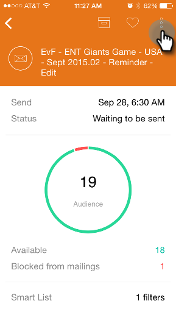
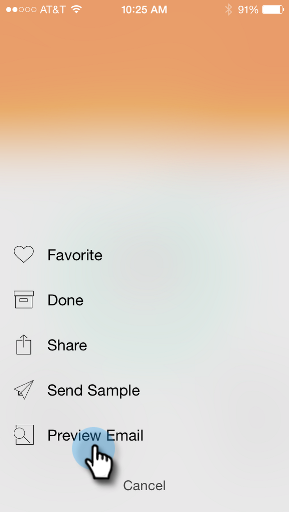
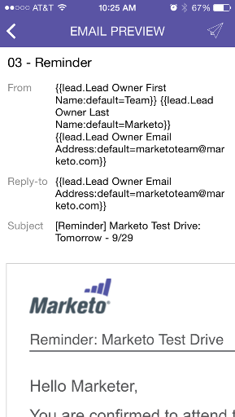

# Previewing an Email {#previewing-an-email}

Right-click on an email card to preview it, before you pull the trigger.

>[!IMPORTANT]
>
>On October 2, 2023, Adobe removed the Marketo Moments App from all App Stores. If you already have the app installed on your tablet/mobile device, you can continue using it for the time being. Once your Marketo Engage instance is migrated to Adobe Identity for authentication of Marketo, you will no longer be able to access the app. [Learn more](https://nation.marketo.com/t5/product-discussions/marketo-events-app-and-marketo-moments-app-end-of-life/m-p/340712/highlight/true#M193869){target="_blank"}.

1. On an email card, tap the three dot action menu.

   

1. Tap **[!UICONTROL Preview Email]**.

   

1. You can view the email on your device.

   

   >[!NOTE]
   >
   >To send a sample directly from the Email Preview page, tap the paper airplane icon in the upper right.
