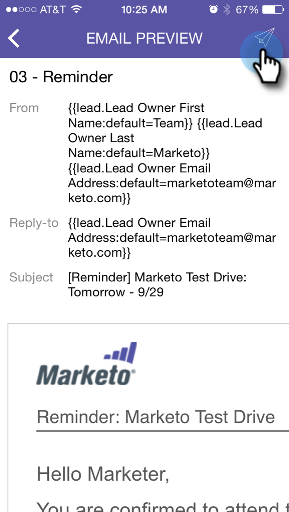

# Sending a Sample {#sending-a-sample}

You can share a sample of an email moment directly with someone. There are two ways to do it.

>[!IMPORTANT]
>
>On October 2, 2023, Adobe removed the Marketo Moments App from all App Stores. If you already have the app installed on your tablet/mobile device, you can continue using it for the time being. Once your Marketo Engage instance is migrated to Adobe Identity for authentication of Marketo, you will no longer be able to access the app. [Learn more](https://nation.marketo.com/t5/product-discussions/marketo-events-app-and-marketo-moments-app-end-of-life/m-p/340712/highlight/true#M193869){target="_blank"}.

## The Regular Way {#the-regular-way}

1. Open the Card Menu.

   

1. Tap **Send Sample**.

   

1. Enter an email address and click **Send Sample**.

   

## The Quick Way {#the-quick-way}

1. Tap the paper airplane icon on the Email Preview screen to send a sample directly from the preview.

   

Mission Accomplished!
