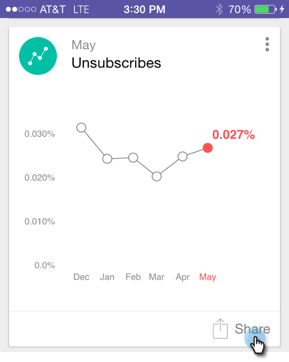
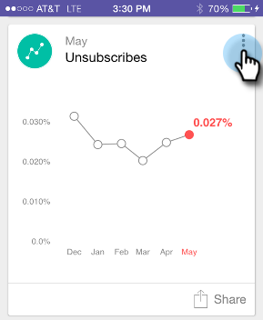

# Sharing a Moment {#sharing-a-moment}

Want to give an update to your team? You've got two choices to select sharing.

>[!IMPORTANT]
>
>On October 2, 2023, Adobe removed the Marketo Moments App from all App Stores. If you already have the app installed on your tablet/mobile device, you can continue using it for the time being. Once your Marketo Engage instance is migrated to Adobe Identity for authentication of Marketo, you will no longer be able to access the app. [Learn more](https://nation.marketo.com/t5/product-discussions/marketo-events-app-and-marketo-moments-app-end-of-life/m-p/340712/highlight/true#M193869){target="_blank"}.

1. Tap the **Share** icon on the card.

   

1. Tap the card menu and tap **Share** on the Details screen.

   

   

1. Select the way you want to share. Let's go with email.

   >[!NOTE]
   >
   >Sharing depends on the apps installed on your phone. So, if you don't have Facebook, you won't see it in Moments.

   

1. Enter your recipient's address, a subject, and tap **Send**.

   

   Great job!
