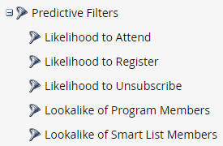
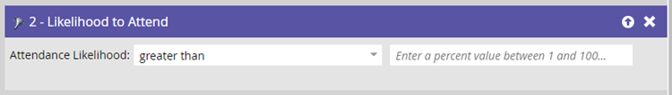
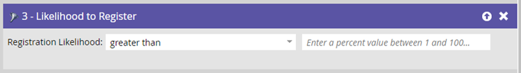
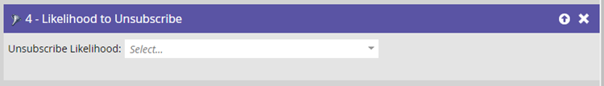
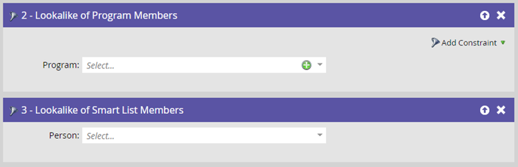

# Predictive Filters {#predictive-filters}

As part of Predictive Audiences, Marketo offers a group of AI/ML-based filters in Smart Lists within Smart Campaigns.

   

>[!NOTE]
>
>The "Likely to Attend" and "Likely to Register" filters are only be able to be used in Event Programs. "Likelihood to Unsubscribe," "Lookalike of Program Members," and "Lookalike of Smart List Members" can be used in all program types.

## Likelihood to Attend {#likelihood-to-attend}

This filter is used to effectively narrow down your audience. This helps you target and invite leads who have a higher likelihood of **attending** your webinar or event. Note that your "Likelihood to Attend program" will be your current event program.

   

## Likelihood to Register {#likelihood-to-register}

Similar to the _Likelihood to Attend_ filter, use this filter to narrow your audience and target leads who have a higher likelihood of **registering** for your webinar or event.

   

## Likelihood to Unsubscribe {#likelihood-to-unsubscribe}

This filters the audience by whether they have a high or low likelihood of unsubscribing in the next two weeks. You can use this to target high-fatigue leads differently and more effectively. The unsubscribe threshold is dynamic and driven by an AI model that considers several attributes, including lead time in the database and lead activities.

   

>[!NOTE]
>
>The Likelihood to Attend/Register/Unsubscribe filters must be used in conjunction with other standard filters.

## Lookalike of Program Members/Lookalike of Smart List Members {#lookalike-of-members}

These two filters help you expand your current audience by targeting additional leads that are similar to members of another program or Smart List. The Lookalike filters consider 50+ factors, including lead attributes, email activity, web activity, and engagement.

Click **[!UICONTROL Add Constraint]** to choose success criteria for members of the selected program(s).

Click the **+** icon to easily add multiple programs/Smart Lists to one filter.

   

## Things to Note {#things-to-note}

* You can apply predictive filters to a Smart Campaign even if the parent program is created before predictive filters are enabled.
* Predictive filters are not available for Trigger Campaigns.
* Cloning or moving campaigns that contain predictive filters is not supported.
* You can use up to 5 predictive filters in a Smart List.
* If Marketo Engage encounters an error in the evaluation of predictive filters, the campaign run will automatically abort and you'll receive a notification in the Marketo notification center.
* Predictive filters currently have an input limit of 1 million qualified people.
* You can have up to 50 active programs with predictive filters.
