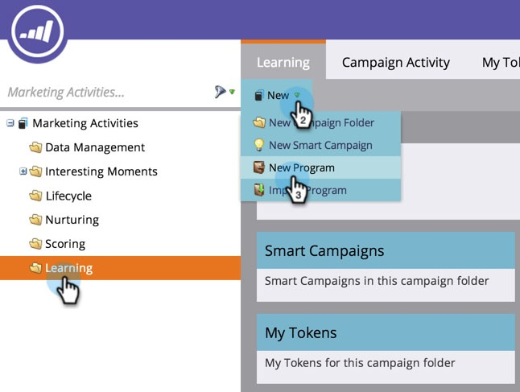
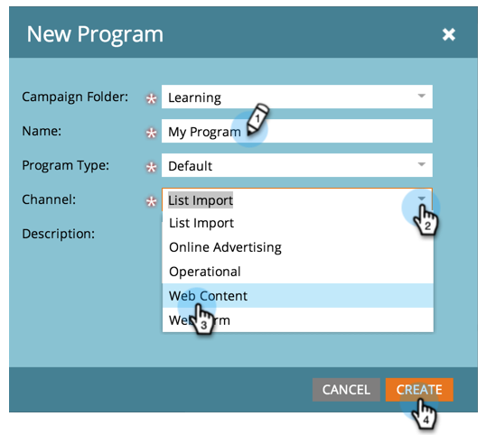

# Create a Program {#create-a-program}

Programs are one of the most important elements in Marketo. You'll be using them a lot!

1. Go to **[!UICONTROL Marketing Activities].**

   

1. Select the folder for the new program. Select **[!UICONTROL New]** and click **[!UICONTROL New Program]**.

   

1. Enter a **[!UICONTROL Name]**, select a **[[!UICONTROL Channel]](https://docs.marketo.com/display/DOCS/Create+a+Program+Channel)** in the drop-down, and click **[!UICONTROL Create]**.

   

>[!MORELIKETHIS]
>
>[Understanding Programs](/help/marketo/product-docs/core-marketo-concepts/programs/creating-programs/understanding-programs.md).
