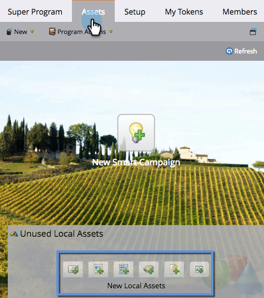
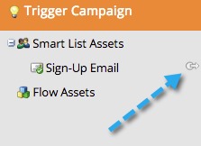

# Using the Assets Tab {#using-the-assets-tab}

The asset canvas is a visual representation of your program. You can use it to add local assets as well as interact with the existing ones.

## Adding Assets {#adding-assets}

From the **Marketing Activities** area, click the **Assets** tab. Choose any of the assets below and add them to your program.

## Manage Your Program  {#manage-your-program}

When there are assets in your program, you'll see them listed here.

| Orange |Trigger Campaign |
|---|---|
| Green |Batch Campaign |

You can right-click on the header if you'd like to interact with that asset.

>[!TIP]
>
>Drag and drop to rearrange the asset columns.

Assets that are not local to your program will look like this:

The assets tab is a great little dashboard for everything inside and referenced in the program.
