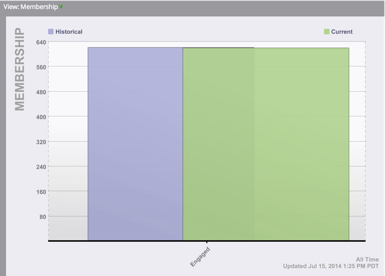

# Using the Program Home Tab {#using-the-program-home-tab}

The program home tab gives you a high-level view of what's going on in your program.

## Summary View {#summary-view}

1. Go to **Marketing Activities**.

   

1. Select a program.

   

   >[!NOTE]
   >
   >This is your default view. It provides information about your Settings, Schedule, Results, and Members Program Status.

1. Click underlined elements to make changes or view more information.

   

1. Click **Export** at the bottom of the Summary to download report.

   

## Used By View {#used-by-view}

1. In Marketing Activities, select a program.

   

1. Click the **View** drop-down. Select **Used By**.

   

   This view shows you what smart campaigns are in use.

   

## Membership View {#membership-view}

1. In Marketing Activities, select a program.

   

1. Click the **View** drop-down. Select **Membership**.

   

   This shows you a graph of where members are as they move through program statuses.

   

   >[!NOTE]
   >
   >**Historical** signifies anyone who ever went through the program, while **Current** only includes people currently in the program.

   >[!MORELIKETHIS]
   >
   >[Understanding Program Membership](/help/marketo/product-docs/core-marketo-concepts/programs/creating-programs/understanding-program-membership.md)
