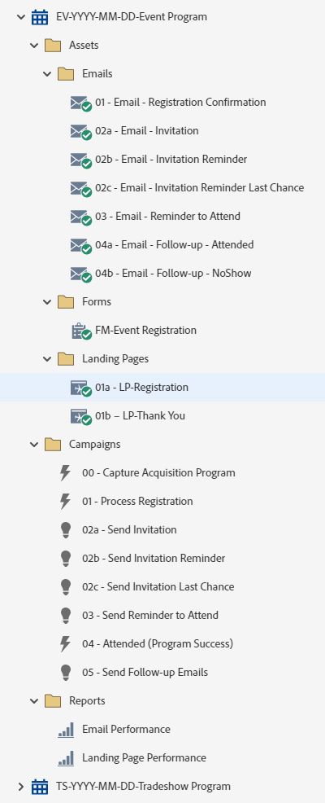

# EV-YYYY-MM-DD-Event Program {#ev-yyyy-mm-dd-event-program}

This is an example of an event program with a registration page, three invitation emails, and follow-up emails utilizing a Marketo Engage Event Program. Suitable for all events where you require registrations, including roadshows, lunches, dinners, or presentations at trade show events.

For further strategy assistance or help customizing a program, please contact the Adobe Account Team or visit the [Adobe Professional Services](https://business.adobe.com/customers/consulting-services/main.html){target="_blank"} page.

## Channel Summary {#channel-summary}

<table style="table-layout:auto"> 
 <tbody> 
  <tr> 
   <th>Channel</th> 
   <th>Membership Status</th>
   <th>Analytics Behavior</th>
   <th>Program Type</th>
  </tr> 
  <tr> 
   <td>Event</td> 
   <td>01-Invited 
 02-Waitlisted
 03-Registered
 04-No Show
 05-Attended-Success</td>
   <td>Inclusive</td>
   <td>Event</td>
  </tr>
 </tbody> 
</table>

## Program Contains the Following Assets {#program-contains-the-following-assets}

<table style="table-layout:auto"> 
 <tbody> 
  <tr> 
   <th>Type</th> 
   <th>Template Name</th>
   <th>Asset Name</th>
  </tr> 
  <tr> 
   <td>Email</td> 
   <td><a href="/help/marketo/product-docs/core-marketo-concepts/programs/program-library/quick-start-email-template.md" target="_blank">Quick Start Email Template</a></td>
   <td>01-Email-Thank You</td>
  </tr>
   <tr> 
   <td>Email</td> 
   <td><a href="/help/marketo/product-docs/core-marketo-concepts/programs/program-library/quick-start-email-template.md" target="_blank">Quick Start Email Template</a></td>
   <td>02a- Email - Invitation</td>
  </tr>
  <tr> 
   <td>Email</td> 
   <td><a href="/help/marketo/product-docs/core-marketo-concepts/programs/program-library/quick-start-email-template.md" target="_blank">Quick Start Email Template</a></td>
   <td>02b - Email - Invitation Reminder</td>
  </tr>
  <tr> 
   <td>Email</td> 
   <td><a href="/help/marketo/product-docs/core-marketo-concepts/programs/program-library/quick-start-email-template.md" target="_blank">Quick Start Email Template</a></td>
   <td>02c- Email - Invitation Reminder Last Chance</td>
  </tr>
  <tr> 
   <td>Email</td> 
   <td><a href="/help/marketo/product-docs/core-marketo-concepts/programs/program-library/quick-start-email-template.md" target="_blank">Quick Start Email Template</a></td>
   <td>03 - Email - Reminder to Attend</td>
  </tr>
  <tr> 
   <td>Email</td> 
   <td><a href="/help/marketo/product-docs/core-marketo-concepts/programs/program-library/quick-start-email-template.md" target="_blank">Quick Start Email Template</a></td>
   <td>04a - Email - Follow-up - Attended</td>
  </tr>
  <tr> 
   <td>Email</td> 
   <td><a href="/help/marketo/product-docs/core-marketo-concepts/programs/program-library/quick-start-email-template.md" target="_blank">Quick Start Email Template</a></td>
   <td>04b - Email - Follow-up - NoShow</td>
  </tr>
  <tr> 
   <td>Landing Page</td> 
   <td><a href="/help/marketo/product-docs/core-marketo-concepts/programs/program-library/quick-start-landing-page-template.md" target="_blank">Quick Start LP Template</a></td>
   <td>01a - LP - Registration</td>
  </tr>
  <tr> 
   <td>Landing Page</td> 
   <td><a href="/help/marketo/product-docs/core-marketo-concepts/programs/program-library/quick-start-landing-page-template.md" target="_blank">Quick Start LP Template</a></td>
   <td>01b - LP - Thank You</td>
  </tr>
  <tr> 
   <td>Form</td> 
   <td>&nbsp</td>
   <td>FM-Event Registration</td>
  </tr>
  <tr> 
   <td>Local Report</td> 
   <td>&nbsp</td>
   <td>Email Performance</td>
  </tr>
  <tr> 
   <td>Local Report</td> 
   <td>&nbsp</td>
   <td>Landing Page Performance</td>
  </tr>
  <tr> 
   <td>Smart Campaign</td> 
   <td>&nbsp</td>
   <td>00 - Capture Acquisition Program</td>
  </tr>
  <tr> 
   <td>Smart Campaign</td> 
   <td>&nbsp</td>
   <td>01 - Process Registration</td>
  </tr>
   <tr> 
   <td>Smart Campaign</td> 
   <td>&nbsp</td>
   <td>02a - Send Invitation</td>
  </tr>
   <tr> 
   <td>Smart Campaign</td> 
   <td>&nbsp</td>
   <td>02b - Send Invitation Reminder</td>
  </tr>
   <tr> 
   <td>Smart Campaign</td> 
   <td>&nbsp</td>
   <td>02c - Send Invitation Last Chance</td>
  </tr>
   <tr> 
   <td>Smart Campaign</td> 
   <td>&nbsp</td>
   <td>03 - Send Reminder to Attend</td>
  </tr>
   <tr> 
   <td>Smart Campaign</td> 
   <td>&nbsp</td>
   <td>04 - Attended (Program Success)</td>
  </tr>
   <tr> 
   <td>Smart Campaign</td> 
   <td>&nbsp</td>
   <td>05 - Send Follow-up Emails</td>
  </tr>
  <tr> 
   <td>Folder</td> 
   <td>&nbsp</td>
   <td>Assets - Houses all creative assets 
 (subfolders for Email & Landing Pages)</td>
  </tr>
  <tr> 
   <td>Folder</td> 
   <td>&nbsp</td>
   <td>Campaigns - Houses all Smart Campaigns</td>
  </tr>
  <tr> 
   <td>Folder</td> 
   <td>&nbsp</td>
   <td>Reports</td>
  </tr>
 </tbody> 
</table>

## My Tokens Included {#my-tokens-included}

<table style="table-layout:auto"> 
 <tbody> 
  <tr> 
   <th>Token Type</th> 
   <th>Token Name</th>
   <th>Value</th>
  </tr>
  <tr> 
   <td>Calendar File</td> 
   <td><code>{{my.AddToCalendar}}</code></td>
   <td>Double Click for Details</td>
  </tr>
  <tr> 
   <td>Text</td> 
   <td><code>{{my.Email-FromAddress}}</code></td>
   <td>PlaceholderFrom.email@mydomain.com</td>
  </tr>
  <tr> 
   <td>Text</td> 
   <td><code>{{my.Email-FromName}}</code></td>
   <td><code><--My From Name Here--></code></td>
  </tr>
  <tr> 
   <td>Text</td> 
   <td><code>{{my.Email-ReplyToAddress}}</code></td>
   <td>reply-to.email@mydomain.com</td>
  </tr>
  <tr> 
   <td>Text</td> 
   <td><code>{{my.Event-Date}}</code></td>
   <td><code><--My Event Date--></code></td>
  </tr>
   <tr> 
   <td>Rich Text</td> 
   <td><code>{{my.Content-Description}}</code></td>
   <td>Double-Click for Details  
 <code><--My Content Description Here--></code> 
 Edit this content description at the program level, under the My Tokens tab. 
 You'll learn: 
<li>Bullet 1</li>
<li>Bullet 2</li>
<li>Bullet 3</li></td>
  </tr>
  <tr> 
   <td>Text</td> 
   <td><code>{{my.Event-Location-Line1}}</code></td>
   <td><code><--XYZ Hotel--></code></td>
  </tr>
   <tr> 
   <td>Text</td> 
   <td><code>{{my.Event-Location-Line2}}</code></td>
   <td><code><--ABC Room--></code></td>
  </tr>
   <tr> 
   <td>Text</td> 
   <td><code>{{my.Event-Location-Line3}}</code></td>
   <td><code><--1234 Anystreet--></code></td>
  </tr>
  <tr> 
   <td>Text</td> 
   <td><code>{{my.Event-Location-Line4}}</code></td>
   <td><code><--Anytown, ZZ 99999--></code></td>
  </tr>
  <tr> 
   <td>Text</td> 
   <td><code>{{my.Event-Time}}</code></td>
   <td><code><--My Event Time + TimeZone--></code></td>
  </tr>
  <tr> 
   <td>Text</td> 
   <td><code>{{my.Event-Title}}</code></td>
   <td><code><--My Event Title Here--></code></td>
  </tr>
  <tr> 
   <td>Text</td> 
   <td><code>{{my.Event-Type}}</code></td>
   <td>Live Event</td>
  </tr>
  <tr> 
   <td>Text</td> 
   <td><code>{{my.PageURL-Download}}</code></td>
   <td>my.DownloadURL?without=http://</td>
  </tr>
  <tr> 
   <td>Text</td> 
   <td><code>{{my.PageURL-Registration}}</code></td>
   <td>my.RegistrationPageURL?without=http://</td>
  </tr>
  <tr> 
   <td>Text</td> 
   <td><code>{{my.PageURL-ThankYou}}</code></td>
   <td>my.ThankYouPageURL?without=http://</td>
  </tr>
  <tr> 
   <td>Text</td> 
   <td><code>{{my.Speaker1-Name}}</code></td>
   <td><code><--Speaker Name Here--></code></td>
  </tr>
  <tr> 
   <td>Text</td> 
   <td><code>{{my.Speaker1-Title}}</code></td>
   <td><code><--Speaker Title Here--></code></td>
  </tr>
  <tr> 
   <td>Text</td> 
   <td><code>{{my.Speaker2-Name}}</code></td>
   <td><code><--Speaker Name Here--></code></td>
  </tr>
  <tr> 
   <td>Text</td> 
   <td><code>{{my.Speaker2-Title}}</code></td>
   <td><code><--Speaker Title Here--></code></td>
  </tr>
  <tr> 
   <td>Text</td> 
   <td><code>{{my.Speaker3-Name}}</code></td>
   <td><code><--Speaker Name Here--></code></td>
  </tr>
 <tr> 
   <td>Text</td> 
   <td><code>{{my.Speaker3-Title}}</code></td>
   <td><code><--Speaker Title Here--></code></td>
  </tr>
 </tbody> 
</table>

## Conflict Rules {#conflict-rules}

* **Program Tags**
   * Create tags in this subscription - _Recommended_
   * Ignore

* **Landing Page template with the same name**
   * Copy original template
   * Use destination template - _Recommended_

* **Images with the same name**
   * Keep both files
   * Replace item in this subscription - _Recommended_

* **Email templates with the same name**
   * Keep both templates
   * Replace existing template - _Recommended_

## Best Practices {#best-practices}

* After import of the webinar program, move the form from a local asset to a global asset located in the Design Studio.
   * Decreasing the number of forms and utilizing more global assets from the Design Studio allows more scalability in your program design and administrative governance. It also provides flexibility in regular compliance updates for fields, opt-in language, etc. 

* Consider updating the templates in your imported program to utilize currently branded templates, or update the newly imported template to reflect your brand by adding in a snippet or your appropriate logo/footer information.

* Consider updating the naming convention of this program example to align with your naming convention.

>[!NOTE]
>
>Remember to update the My Token Values on the program template and each time you use the program, as needed.

>[!TIP]
>
>Don't forget to activate the "06-Attended (Program Success)" Campaign for tracking success! Do this _before_ your form is live and emails are sent.

>[!IMPORTANT]
>
>My Tokens that reference a URL cannot contain the http:// or https:// otherwise the link will not work appropriately within the asset.
