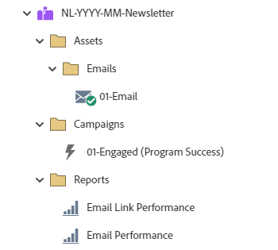

# NL-YYYY-MM-Newsletter {#nl-yyyy-mm-newsletter}

This example sends one newsletter email utilizing a Marketo Engage Email Program. The email can include or not include an A/B test.

For further strategy assistance or help customizing a program, please contact the Adobe Account Team or visit the [Adobe Professional Services](https://business.adobe.com/customers/consulting-services/main.html){target="_blank"} page.

## Channel Summary {#channel-summary}

<table style="table-layout:auto"> 
 <tbody> 
  <tr> 
   <th>Channel</th> 
   <th>Membership Status</th>
   <th>Analytics Behavior</th>
   <th>Program Type</th>
  </tr> 
  <tr> 
   <td>Newsletter</td> 
   <td>01-Member 
 02-Engaged-Success</td>
   <td>Inclusive</td>
   <td>Email</td>
  </tr>
 </tbody> 
</table>

## Program Contains the Following Assets {#program-contains-the-following-assets}

<table style="table-layout:auto"> 
 <tbody> 
  <tr> 
   <th>Type</th> 
   <th>Template Name</th>
   <th>Asset Name</th>
  </tr> 
  <tr> 
   <td>Email</td> 
   <td><a href="/help/marketo/product-docs/core-marketo-concepts/programs/program-library/quick-start-email-template.md" target="_blank">Quick Start Email Template</a></td>
   <td>01 - Email</td>
  </tr>
  <tr> 
   <td>Local Report</td> 
   <td>&nbsp</td>
   <td>Email Performance</td>
  </tr>
  <tr> 
   <td>Local Report</td> 
   <td>&nbsp</td>
   <td>Email Link Performance</td>
  </tr>
  <tr>
  <tr> 
   <td>Smart Campaign</td> 
   <td>&nbsp</td>
   <td>01 - Engaged (Program Success)</td>
  </tr>
  <tr> 
   <td>Folder</td> 
   <td>&nbsp</td>
   <td>Assets - Houses all creative assets 
 (subfolders for Emails)  </td>
  </tr>
  <tr> 
   <td>Folder</td> 
   <td>&nbsp</td>
   <td>Campaigns - Houses all Smart Campaigns</td>
  </tr>
  <tr> 
   <td>Folder</td> 
   <td>&nbsp</td>
   <td>Reports</td>
  </tr>
 </tbody> 
</table>

## My Tokens Included {#my-tokens-included}

<table style="table-layout:auto"> 
 <tbody> 
  <tr> 
   <th>Token Type</th> 
   <th>Token Name</th>
   <th>Value</th>
  </tr>
  <tr> 
   <td>Text</td> 
   <td><code>{{my.Email-FromAddress}}</code></td>
   <td>PlaceholderFrom.email@mydomain.com</td>
  </tr>
  <tr> 
   <td>Text</td> 
   <td><code>{{my.Email-FromName}}</code></td>
   <td><code><--My From Name Here--></code></td>
  </tr>
  <tr> 
   <td>Text</td> 
   <td><code>{{my.Email-ReplyToAddress}}</code></td>
   <td>reply-to.email@mydomain.com</td>
  </tr>
 </tbody> 
</table>

## Conflict Rules {#conflict-rules}

* **Program Tags**
   * Create tags in this subscription - _Recommended_
   * Ignore

* **Landing Page template with the same name**
   * Copy original template
   * Use destination template - _Recommended_

* **Images with the same name**
   * Keep both files
   * Replace item in this subscription - _Recommended_

* **Email templates with the same name**
   * Keep both templates
   * Replace existing template - _Recommended_

## Best Practices {#best-practices}

* Consider updating the templates in your imported program to utilize currently branded templates, or update the newly imported template to reflect your brand by adding in a snippet or your appropriate logo/footer information.

* Consider updating the naming convention of this program example to align with your naming convention.

>[!NOTE]
>
>Remember to update the My Token Values on the program template and each time you use the program, as needed.

>[!TIP]
>
>Don't forget to activate the "01-Engaged" campaign for tracking success! Do this _before_ your form is live and emails are sent.
