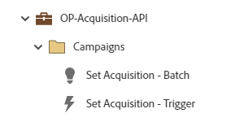

# OP-Acquisition-API {#op-acquisition-api}

This example program is for operational processes to track the acquisition of records from API sources utilizing a Marketo Engage Default Program.

## Channel Summary {#channel-summary}

<table style="table-layout:auto"> 
 <tbody> 
  <tr> 
   <th>Channel</th> 
   <th>Membership Status</th>
   <th>Analytics Behavior</th>
   <th>Program Type</th>
  </tr> 
  <tr> 
   <td>Operational</td> 
   <td>01-Member</td>
   <td>Operational</td>
   <td>Default</td>
  </tr>
 </tbody> 
</table>

## Program Contains the Following Assets {#program-contains-the-following-assets}

<table style="table-layout:auto"> 
 <tbody> 
  <tr> 
   <th>Type</th> 
   <th>Template Name</th>
   <th>Asset Name</th>
  </tr>
  <tr> 
   <td>Smart Campaign</td> 
   <td>&nbsp</td>
   <td>Set Acquisition - Batch</td>
  </tr>
  <tr> 
   <td>Smart Campaign</td> 
   <td>&nbsp</td>
   <td>Set Acquisition - Trigger</td>
  </tr>
  <tr> 
   <td>Folder</td> 
   <td>&nbsp</td>
   <td>Campaigns (contains all Smart Campaigns)</td>
  </tr>
 </tbody> 
</table>

## Conflict Rules {#conflict-rules}

* **Program Tags**
   * Create tags in this subscription - _Recommended_
   * Ignore

* **Landing Page template with the same name**
   * Copy original template - _Recommended_
   * Use destination template

* **Images with the same name**
   * Keep both files - _Recommended_
   * Replace item in this subscription

* **Email templates with the same name**
   * Keep both templates - _Recommended_
   * Replace existing template

## Best Practices {#best-practices}

* Run the Batch Campaign first if you need to catch up in your data management.

* Consider utilizing similar programs to ensure alignment to best practices across all input sources to include your CRM or Data Integrations.

* Within channel specific channel marketing initiatives, be sure to capture acquisition when needed.
