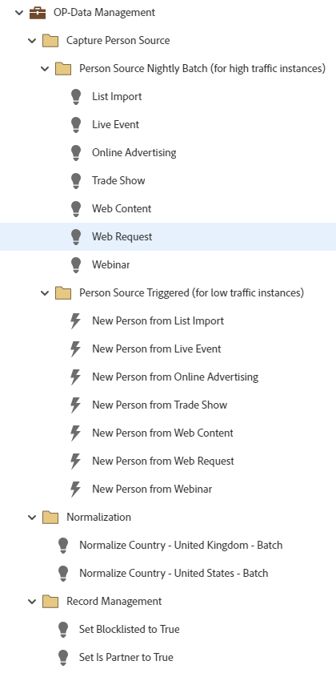

# OP-Data Management {#op-data-management}

This is an example of simple operational data management best practice workflows using a Default Program, to assist you in managing data consistency for records within your Marketo Engage database. 

For further strategy assistance or help customizing a program, please contact the Adobe Account Team or visit the [Adobe Professional Services](https://business.adobe.com/customers/consulting-services/main.html){target="_blank"} page.

## Channel Summary {#channel-summary}

<table style="table-layout:auto"> 
 <tbody> 
  <tr> 
   <th>Channel</th> 
   <th>Membership Status</th>
   <th>Analytics Behavior</th>
   <th>Program Type</th>
  </tr> 
  <tr> 
   <td>Operational</td> 
   <td>01-Member</td>
   <td>Operational</td>
   <td>Default</td>
  </tr>
 </tbody> 
</table>

## Program Contains the Following Assets {#program-contains-the-following-assets}

<table style="table-layout:auto"> 
 <tbody> 
  <tr> 
   <th>Type</th> 
   <th>Template Name</th>
   <th>Asset Name</th>
  </tr>
  <tr> 
   <td>Smart Campaign</td> 
   <td>&nbsp</td>
   <td>Normalize Country - United States</td>
  </tr>
  <tr> 
   <td>Smart Campaign</td> 
   <td>&nbsp</td>
   <td>Normalize Country - United Kingdom</td>
  </tr>
  <tr> 
   <td>Smart Campaign</td> 
   <td>&nbsp</td>
   <td>Set Blocklisted to True</td>
  </tr>
  <tr> 
   <td>Smart Campaign</td> 
   <td>&nbsp</td>
   <td>Set Is Partner to True</td>
  </tr>
  <tr> 
   <td>Smart Campaign</td> 
   <td>&nbsp</td>
   <td>List Import</td>
  </tr>
  <tr> 
   <td>Smart Campaign</td> 
   <td>&nbsp</td>
   <td>Live Event</td>
  </tr>
  <tr> 
   <td>Smart Campaign</td> 
   <td>&nbsp</td>
   <td>Online Advertising</td>
  </tr>
  <tr> 
   <td>Smart Campaign</td> 
   <td>&nbsp</td>
   <td>Trade Show</td>
  </tr>
  <tr> 
   <td>Smart Campaign</td> 
   <td>&nbsp</td>
   <td>Web Content</td>
  </tr>
  <tr> 
   <td>Smart Campaign</td> 
   <td>&nbsp</td>
   <td>Web Request</td>
  </tr>
  <tr> 
   <td>Smart Campaign</td> 
   <td>&nbsp</td>
   <td>Webinar</td>
  </tr>
  <tr> 
   <td>Smart Campaign</td> 
   <td>&nbsp</td>
   <td>New Person from List Import</td>
  </tr>
  <tr> 
   <td>Smart Campaign</td> 
   <td>&nbsp</td>
   <td>New Person from Live Event</td>
  </tr>
  <tr> 
   <td>Smart Campaign</td> 
   <td>&nbsp</td>
   <td>New Person from Online Advertising</td>
  </tr>
  <tr> 
   <td>Smart Campaign</td> 
   <td>&nbsp</td>
   <td>New Person from Trade Show</td>
  </tr>
   <tr> 
   <td>Smart Campaign</td> 
   <td>&nbsp</td>
   <td>New Person from Web Content</td>
  </tr>
   <tr> 
   <td>Smart Campaign</td> 
   <td>&nbsp</td>
   <td>New Person from Web Request</td>
  </tr>
   <tr> 
   <td>Smart Campaign</td> 
   <td>&nbsp</td>
   <td>New Person from Webinar</td>
  </tr>
  <tr> 
   <td>Folder</td> 
   <td>&nbsp</td>
   <td>Person Source Nightly Batch (for high traffic instances)</td>
  </tr>
  <tr> 
   <td>Folder</td> 
   <td>&nbsp</td>
   <td>Person Source Triggered (for low traffic instances)</td>
  </tr>
  <tr> 
   <td>Folder</td> 
   <td>&nbsp</td>
   <td>Capture Person Source</td>
  </tr>
  <tr> 
   <td>Folder</td> 
   <td>&nbsp</td>
   <td>Normalization</td>
  </tr>
  <tr> 
   <td>Folder</td> 
   <td>&nbsp</td>
   <td>Record Management</td>
  </tr>
  <tr> 
   <td>Folder</td> 
   <td>&nbsp</td>
   <td>Blocklist</td>
  </tr>
 </tbody> 
</table>

## Conflict Rules {#conflict-rules}

* **Program Tags**
   * Create tags in this subscription - _Recommended_
   * Ignore

* **Landing Page template with the same name**
   * Copy original template - _Recommended_
   * Use destination template

* **Images with the same name**
   * Keep both files - _Recommended_
   * Replace item in this subscription

* **Email templates with the same name**
   * Keep both templates - _Recommended_
   * Replace existing template

## Best Practices {#best-practices}

* Each campaign built is meant to be an example on the best practice build and not specific to your use cases. Remember to update the Smart Campaigns to address your specific pain points and data challenges.  

* Consider updating the naming convention of this program example to align with your naming convention.
