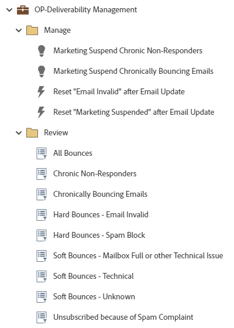

# OP-Deliverability Management {#op-deliverability-management}

This is an example of deliverability management best practice workflows utilizing a Marketo Engage Default Program, to review your current state of email deliverability and manage chronic bounces and non-responders.  

>[!NOTE]
>
>Requires custom string field "Marketing Suspended Reason" to import. [Learn more](https://nation.marketo.com/community/product_and_support/support_solutions/blog/2016/04/18/how-to-monitor-deliverability-using-marketo){target="_blank"}.

For further strategy assistance or help customizing a program, please contact the Adobe Account Team or visit the [Adobe Professional Services](https://business.adobe.com/customers/consulting-services/main.html){target="_blank"} page.

## Channel Summary {#channel-summary}

<table style="table-layout:auto"> 
 <tbody> 
  <tr> 
   <th>Channel</th> 
   <th>Membership Status</th>
   <th>Analytics Behavior</th>
   <th>Program Type</th>
  </tr> 
  <tr> 
   <td>Operational</td> 
   <td>01-Member</td>
   <td>Operational</td>
   <td>Default</td>
  </tr>
 </tbody> 
</table>

## Prerequisite Fields {#prerequisite-fields}

<table style="table-layout:auto"> 
 <tbody> 
  <tr> 
   <th>Type</th> 
   <th>Friendly Name</th>
   <th>API Name</th>
  </tr>
  <tr> 
   <td>String</td> 
   <td>Marketing Suspended Reason</td>
   <td>MarketingSuspendedReason</td>
  </tr>
 </tbody> 
</table>

## Program Contains the Following Assets {#program-contains-the-following-assets}

<table style="table-layout:auto"> 
 <tbody> 
  <tr> 
   <th>Type</th> 
   <th>Template Name</th>
   <th>Asset Name</th>
  </tr>
  <tr> 
   <td>Smart Campaign</td> 
   <td>&nbsp</td>
   <td>Marketing Suspend Chronic Non-Responders</td>
  </tr>
  <tr> 
   <td>Smart Campaign</td> 
   <td>&nbsp</td>
   <td>Marketing Suspend Chronically Bouncing Emails</td>
  </tr>
  <tr> 
   <td>Smart Campaign</td> 
   <td>&nbsp</td>
   <td>Reset "Email Invalid" after Email Update</td>
  </tr>
  <tr> 
   <td>Smart Campaign</td> 
   <td>&nbsp</td>
   <td>Reset "Marketing Suspended" after Email Update</td>
  </tr>
  <tr> 
   <td>Folder</td> 
   <td>&nbsp</td>
   <td>Manage</td>
  </tr>
  <tr> 
   <td>Folder</td> 
   <td>&nbsp</td>
   <td>Review</td>
  </tr>
 </tbody> 
</table>

## Conflict Rules {#conflict-rules}

* **Program Tags**
   * Create tags in this subscription - _Recommended_
   * Ignore

* **Landing Page template with the same name**
   * Copy original template - _Recommended_
   * Use destination template

* **Images with the same name**
   * Keep both files - _Recommended_
   * Replace item in this subscription

* **Email templates with the same name**
   * Keep both templates - _Recommended_
   * Replace existing template

## Best Practices {#best-practices}

* Each campaign built is meant to be an example on the best practice build and not specific to your use cases. Remember to update the Smart Campaigns to address your specific pain points and data challenges.  

* Consider updating the naming convention of this program example to align with your naming convention.
