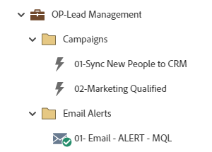

# OP-Lead Management {#op-lead-management}

This is an example of lead management best practice workflows, utilizing a Marketo Engage Default Program, to assist you in managing records within your Marketo Engage database to your CRM.

>[!NOTE]
>
>In Marketo Engage, records in your database are referred to as people/person. Lead management in this example is in reference to the records in your CRM.

For further strategy assistance or help customizing a program, please contact the Adobe Account Team or visit the [Adobe Professional Services](https://business.adobe.com/customers/consulting-services/main.html) page.

## Channel Summary {#channel-summary}

<table style="table-layout:auto"> 
 <tbody> 
  <tr> 
   <th>Channel</th> 
   <th>Membership Status</th>
   <th>Analytics Behavior</th>
   <th>Program Type</th>
  </tr> 
  <tr> 
   <td>Operational</td> 
   <td>01-Member</td>
   <td>Operational</td>
   <td>Default</td>
  </tr>
 </tbody> 
</table>

## Program Contains the Following Assets {#program-contains-the-following-assets}

<table style="table-layout:auto"> 
 <tbody> 
  <tr> 
   <th>Type</th> 
   <th>Template Name</th>
   <th>Asset Name</th>
  </tr> 
  <tr> 
   <td>Smart Campaign</td> 
   <td>&nbsp</td>
   <td>01 - Sync New People to CRM</td>
  </tr>
  <tr> 
   <td>Smart Campaign</td> 
   <td>&nbsp</td>
   <td>02 - Marketing Qualified</td>
  </tr>
  <tr> 
   <td>Email</td> 
   <td><a href="/help/marketo/product-docs/core-marketo-concepts/programs/program-library/quick-start-email-template.md" target="_blank">Quick Start Email Template</a></td>
   <td>01 - Email - ALERT - MQL</td>
  </tr>
  <tr> 
   <td>Folder</td> 
   <td>&nbsp</td>
   <td>Campaigns</td>
  </tr>
  <tr> 
   <td>Folder</td> 
   <td>&nbsp</td>
   <td>Email Alert</td>
  </tr>
 </tbody> 
</table>

## Conflict Rules {#conflict-rules}

* **Program Tags** 
   * Create tags in this subscription - _Recommended_  
   * Ignore

* **Landing Page template with the same name**
   * Copy original template - _Recommended_ 
   * Use destination template 

* **Images with the same name**
   * Keep both files - _Recommended_ 
   * Replace item in this subscription  

* **Email templates with the same name**
   * Keep both templates - _Recommended_ 
   * Replace existing template

## Best Practices {#best-practices}

* Consider adding additional Smart Campaigns to address each of the lifecycle status needs you may be tracking in your organization. Each campaign built in this program is meant to be an example of the best practice build and not specific to all use cases. Remember to update the Smart Campaigns to address your specific lead lifecycle management process.  

* Consider updating the naming convention of this program example to align with yours.
