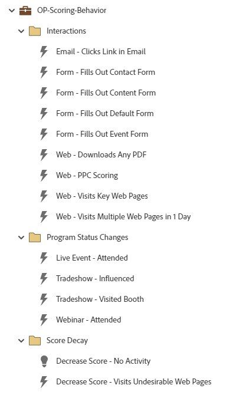

# OP-Scoring-Behavior {#op-scoring-behavior}

This example is an advanced (tokenized) Operational Program for Behavior Scoring using a Marketo Engage Default Program. View and edit the scoring values under the program's "My Tokens" tab. Requires custom score field called "Behavior Score."

For further strategy assistance or help customizing a program, please contact the Adobe Account Team or visit the [Adobe Professional Services](https://business.adobe.com/customers/consulting-services/main.html){target="_blank"} page.

## Channel Summary {#channel-summary}

<table style="table-layout:auto"> 
 <tbody> 
  <tr> 
   <th>Channel</th> 
   <th>Membership Status</th>
   <th>Analytics Behavior</th>
   <th>Program Type</th>
  </tr> 
  <tr> 
   <td>Operational</td> 
   <td>01-Member</td>
   <td>Operational</td>
   <td>Default</td>
  </tr>
 </tbody> 
</table>

## Prerequisite Fields {#prerequisite-fields}

<table style="table-layout:auto"> 
 <tbody> 
  <tr> 
   <th>Type</th> 
   <th>Friendly Name</th>
   <th>API Name</th>
  </tr>
  <tr> 
   <td>Score</td> 
   <td>Behavior Score</td>
   <td>BehaviorScore</td>
  </tr>
 </tbody> 
</table>

## Program Contains the Following Assets {#program-contains-the-following-assets}

<table style="table-layout:auto"> 
 <tbody> 
  <tr> 
   <th>Type</th> 
   <th>Template Name</th>
   <th>Asset Name</th>
  </tr>
  <tr> 
   <td>Smart Campaign</td> 
   <td>&nbsp</td>
   <td>Email - Clicks Link in Email</td>
  </tr>
  <tr> 
   <td>Smart Campaign</td> 
   <td>&nbsp</td>
   <td>Form - Fills Out Contact Form</td>
  </tr>
  <tr> 
   <td>Smart Campaign</td> 
   <td>&nbsp</td>
   <td>Form - Fills Out Content Form</td>
  </tr>
  <tr> 
   <td>Smart Campaign</td> 
   <td>&nbsp</td>
   <td>Form - Fills Out Default Form</td>
  </tr>
  <tr> 
   <td>Smart Campaign</td> 
   <td>&nbsp</td>
   <td>Form - Fills Out Event Form</td>
  </tr>
  <tr> 
   <td>Smart Campaign</td> 
   <td>&nbsp</td>
   <td>Web - Downloads Any PDF</td>
  </tr>
  <tr> 
   <td>Smart Campaign</td> 
   <td>&nbsp</td>
   <td>Web - PPC Scoring</td>
  </tr>
  <tr> 
   <td>Smart Campaign</td> 
   <td>&nbsp</td>
   <td>Web - Visits Key Web Pages</td>
  </tr>
  <tr> 
   <td>Smart Campaign</td> 
   <td>&nbsp</td>
   <td>Web - Visits Multiple Web Pages in 1 Day</td>
  </tr>
  <tr> 
   <td>Smart Campaign</td> 
   <td>&nbsp</td>
   <td>Live Event - Attended</td>
  </tr>
  <tr> 
   <td>Smart Campaign</td> 
   <td>&nbsp</td>
   <td>Tradeshow - Influenced</td>
  </tr>
  <tr> 
   <td>Smart Campaign</td> 
   <td>&nbsp</td>
   <td>Tradeshow - Visited Booth</td>
  </tr>
  <tr> 
   <td>Smart Campaign</td> 
   <td>&nbsp</td>
   <td>Webinar - Attended</td>
  </tr>
  <tr> 
   <td>Smart Campaign</td> 
   <td>&nbsp</td>
   <td>Decrease Score - No Activity</td>
  </tr>
  <tr> 
   <td>Smart Campaign</td> 
   <td>&nbsp</td>
   <td>Decrease Score - Visits Undesirable Web Pages</td>
  </tr>
  <tr> 
   <td>Folder</td> 
   <td>&nbsp</td>
   <td>Interactions</td>
  </tr>
  <tr> 
   <td>Folder</td> 
   <td>&nbsp</td>
   <td>Program Status Changes</td>
  </tr>
  <tr> 
   <td>Folder</td> 
   <td>&nbsp</td>
   <td>Score Decay</td>
  </tr>
 </tbody> 
</table>

## My Tokens Included {#my-tokens-included}

<table style="table-layout:auto"> 
 <tbody> 
  <tr> 
   <th>Token Type</th> 
   <th>Token Name</th>
   <th>Value</th>
  </tr>
  <tr> 
   <td>Score</td> 
   <td><code>{{my.Decrease Score - No Activity}}</code></td>
   <td>-10</td>
  </tr>
  <tr> 
   <td>Score</td> 
   <td><code>{{my.Decrease Score - Visits Undesirable Web Pages}}</code></td>
   <td>-5</td>
  </tr>
  <tr> 
   <td>Score</td> 
   <td><code>{{my.Email - Clicks Link}}</code></td>
   <td>+2</td>
  </tr>
   <tr> 
   <td>Score</td> 
   <td><code>{{my.Form - Fills Out Contact Form}}</code></td>
   <td>+30</td>
  </tr>
  <tr> 
   <td>Score</td> 
   <td><code>{{my.Form - Fills Out Content Form}}</code></td>
   <td>+15</td>
  </tr>
  <tr> 
   <td>Score</td> 
   <td><code>{{my.Form - Fills Out Default Form}}</code></td>
   <td>+10</td>
  </tr>
   <tr> 
   <td>Score</td> 
   <td><code>{{my.Form - Fills-out Event Form}}</code></td>
   <td>+15</td>
  </tr>
  <tr> 
   <td>Score</td> 
   <td><code>{{my.Live Event - Attended}}</code></td>
   <td>+30</td>
  </tr>
   <tr> 
   <td>Score</td> 
   <td><code>{{my.Tradeshow - Influenced}}</code></td>
   <td>+20</td>
  </tr>
  <tr> 
   <td>Score</td> 
   <td><code>{{my.Tradeshow - Visited Booth}}</code></td>
   <td>+5</td>
  </tr>
  <tr> 
   <td>Score</td> 
   <td><code>{{my.Web - Downloaded Any PDF}}</code></td>
   <td>+5</td>
  </tr>
  <tr> 
   <td>Score</td> 
   <td><code>{{my.Web - PPC Scoring}}</code></td>
   <td>+15</td>
  </tr>
   <tr> 
   <td>Score</td> 
   <td><code>{{my.Web - Visits Key Web Pages}}</code></td>
   <td>+5</td>
  </tr>
  <tr> 
   <td>Score</td> 
   <td><code>{{my.Web - Visits Multiple Web Pages in 1 Day}}</code></td>
   <td>+5</td>
  </tr>
  <tr> 
   <td>Score</td> 
   <td><code>{{my.Webinar - Attended}}</code></td>
   <td>+20</td>
  </tr>
 </tbody> 
</table>

## Conflict Rules {#conflict-rules}

* **Program Tags**
   * Create tags in this subscription - _Recommended_
   * Ignore

* **Landing Page template with the same name**
   * Copy original template - _Recommended_
   * Use destination template

* **Images with the same name**
   * Keep both files - _Recommended_
   * Replace item in this subscription

* **Email templates with the same name**
   * Keep both templates - _Recommended_
   * Replace existing template

## Best Practices {#best-practices}

* Each campaign built is meant to be an example of the best practice build and not specific to your use cases. Remember to update the Smart Campaigns to address your specific pain points and data challenges.

* Consider updating the naming convention of this program example to align with your naming convention.
