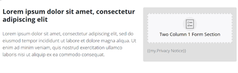
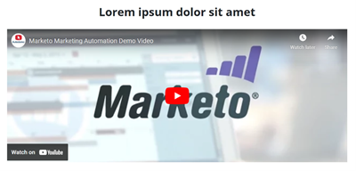
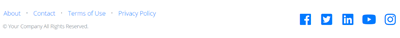

# Quick Start Landing Page Template {#quick-start-landing-page-template}

Some of the starter programs in the Marketo Engage Reference Library contain a simple, easy to use, and customizable Landing Page template that allows for the quick creation of Landing Pages across a number of marketing use cases.

>[!TIP]
>
>Learn more about [Guided Landing Page Templates](/help/marketo/product-docs/demand-generation/landing-pages/landing-page-templates/create-a-guided-landing-page-template.md){target="_blank"}

For further strategy assistance or help customizing a program, please contact the Adobe Account Team or visit the [Adobe Professional Services](https://business.adobe.com/customers/consulting-services/main.html){target="_blank"} page.

## Sections Summary {#sections-summary}

### Logo Section {#logo-section}

* Includes image element to swap out the logo for another image
* Includes variables to edit:
  * Logo size
  * Logo alignment
  * Background color for the logo section
  * Show or hide the section
  * Top padding of the section
  * Bottom padding of the section
* 
 
### Image Section {#image-section}

* Includes image element to swap out the logo for another image 
* Includes variables to edit: 
  * The banner image link 
  * The banner width - one of the switches on the bottom right allows you to make the image either the width of the content container or the width of the entire browser 
  * Show or hide the section 
* 
 
### 2-Col Text on Left, Form on Right Section {#two-col-left-form-right}

* Headline text element to update headline copy 
* Paragraph text element to update paragraph copy 
* Form element to add in a form 
* Text element below the form to edit privacy policy text and links  
* Variables to edit: 
   Background color for section 
  * Background color directly behind the form 
  * Border radius for box around form (making it have curved corners or, if set to "0", squared off corners) 
  * Show or hide the entire section 
  * Show or hide just the form (hiding the form causes the text in the left column to fill the width of the page. This could be used for a thank you or confirmation page where a form is not present.) 
  * Show or hide the privacy policy text 
* 

### Video Section {#video-section}

* Text element to update the headline text
* Variables to edit:
  * Background color for section
  * Video embed code
  * Show/hide video headline
  * Show/hide video
* 
 
### Footer Section {#footer-section}

* Text element to edit the content in the left column 
* Text element to update the social icons (icons are using the FontAwesome font instead of images but they could be replaced with images). 
* Variables to edit: 
  * Background color for section 
  * Social icons color 
  * Show/hide section 
* 

### Additional Variables {#additional-variables}
 
* **Button border radius**: adjusts the form button to be either rounded or rectangular 
* **Button color**: updates the color of the button on the form 
* **Button hover color**: changes the hover state color for the button on the form 
* **Link color**: updates the color of links throughout the page 
* **Section Top Spacing**: adds space above each section except the logo section 
* **Section Bottom Spacing**: adds space below each section except the logos section
