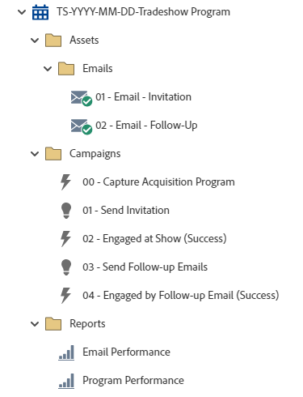

# TS-YYYY-MM-DD-Tradeshow Program {#ts-yyyy-mm-dd-tradeshow-program}

This is an example of a tradeshow program with invites and follow-up emails utilizing a Marketo Engage Event Program.

For further strategy assistance or help customizing a program, please contact the Adobe Account Team or visit the [Adobe Professional Services](https://business.adobe.com/customers/consulting-services/main.html){target="_blank"} page.

## Channel Summary {#channel-summary}

<table style="table-layout:auto">
 <tbody>
  <tr>
   <th>Channel</th>
   <th>Membership Status</th>
   <th>Analytics Behavior</th>
   <th>Program Type</th>
  </tr>
  <tr>
   <td>Event</td>
   <td>01-Invited
    02-Waitlisted
    03-Registered
    04-Visited Booth
    05-Engaged at Show - Success
    06-Engaged at Post Show - Success</td>
   <td>Inclusive</td>
   <td>Event</td>
  </tr>
 </tbody>
</table>

## Program Contains the Following Assets {#program-contains-the-following-assets}

<table style="table-layout:auto">
 <tbody>
  <tr>
   <th>Type</th>
   <th>Template Name</th>
   <th>Asset Name</th>
  </tr>
  <tr>
   <td>Email</td>
   <td><a href="/help/marketo/product-docs/core-marketo-concepts/programs/program-library/quick-start-email-template.md" target="_blank">Quick Start Email Template</a></td>
   <td>01-Email-Thank You</td>
  </tr>
   <tr>
   <td>Email</td>
   <td><a href="/help/marketo/product-docs/core-marketo-concepts/programs/program-library/quick-start-email-template.md" target="_blank">Quick Start Email Template</a></td>
   <td>02a- Email - Invitation</td>
  </tr>
  <tr>
  <tr>
   <td>Local Report</td>
   <td>&nbsp</td>
   <td>Email Performance</td>
  </tr>
  <tr>
   <td>Local Report</td>
   <td>&nbsp</td>
   <td>Program Performance</td>
  </tr>
  <tr>
   <td>Smart Campaign</td>
   <td>&nbsp</td>
   <td>00 - Capture Acquisition Program</td>
  </tr>
  <tr>
   <td>Smart Campaign</td>
   <td>&nbsp</td>
   <td>01 - Send Invitation</td>
  </tr>
   <tr>
   <td>Smart Campaign</td>
   <td>&nbsp</td>
   <td>02 - Send Follow-up Emails</td>
  </tr>
   <tr>
   <td>Smart Campaign</td>
   <td>&nbsp</td>
   <td>03 - Engaged by Follow-up Email (Success)</td>
  </tr>
  <tr>
   <td>Folder</td>
   <td>&nbsp</td>
   <td>Assets - Houses all creative assets
 (subfolders for Email & Landing Pages)</td>
  </tr>
  <tr>
   <td>Folder</td>
   <td>&nbsp</td>
   <td>Campaigns - Houses all Smart Campaigns</td>
  </tr>
  <tr>
   <td>Folder</td>
   <td>&nbsp</td>
   <td>Reports</td>
  </tr>
 </tbody>
</table>

## My Tokens Included {#my-tokens-included}

<table style="table-layout:auto">
 <tbody>
  <tr>
   <th>Token Type</th>
   <th>Token Name</th>
   <th>Value</th>
  </tr>
  <tr>
   <td>Calendar File</td>
   <td><code>{{my.AddToCalendar}}</code></td>
   <td>Double Click for Details</td>
  </tr>
  <tr>
   <td>Text</td>
   <td><code>{{my.Email-FromAddress}}</code></td>
   <td>PlaceholderFrom.email@mydomain.com</td>
  </tr>
  <tr>
   <td>Text</td>
   <td><code>{{my.Email-FromName}}</code></td>
   <td><code><--My From Name Here--></code></td>
  </tr>
  <tr>
   <td>Text</td>
   <td><code>{{my.Email-ReplyToAddress}}</code></td>
   <td>reply-to.email@mydomain.com</td>
  </tr>
  <tr>
   <td>Text</td>
   <td><code>{{my.Event-Date}}</code></td>
   <td><code><--My Event Date--></code></td>
  </tr>
   <tr>
   <td>Rich Text</td>
   <td><code>{{my.Event-Booth#}}</code></td>
   <td><code><--My Booth Number--></code></td>
  </tr>
   <tr>
   <td>Text</td>
   <td><code>{{my.Event-City}}</code></td>
   <td><code><--My Event City Here--></code></td>
  </tr>
  <tr>
   <td>Text</td>
   <td><code>{{my.Event-Date}}</code></td>
   <td><code><--My Event Date--></code></td>
  </tr>
  <tr>
   <td>Text</td>
   <td><code>{{my.Event-Time}}</code></td>
   <td><code><--My Event Time + TimeZone--></code></td>
  </tr>
  <tr>
   <td>Text</td>
   <td><code>{{my.Event-Title}}</code></td>
   <td><code><--My Event Title Here--></code></td>
  </tr>
  <tr>
   <td>Text</td>
   <td><code>{{my.Event-Type}}</code></td>
   <td>Tradeshow</td>
  </tr>
 </tbody>
</table>

## Conflict Rules {#conflict-rules}

* **Program Tags**
  * Create tags in this subscription - _Recommended_
  * Ignore

* **Landing Page template with the same name**
  * Copy original template
  * Use destination template - _Recommended_

* **Images with the same name**
  * Keep both files
  * Replace item in this subscription - _Recommended_

* **Email templates with the same name**
  * Keep both templates
  * Replace existing template - _Recommended_

## Best Practices {#best-practices}

* After import of the webinar program, move the form from a local asset to a global asset located in the Design Studio.
  * Decreasing the number of forms and utilizing more global assets from the Design Studio allows more scalability in your program design and administrative governance. It also provides flexibility in regular compliance updates for fields, opt-in language, etc.

* Consider updating the templates in your imported program to utilize currently branded templates, or update the newly imported template to reflect your brand by adding in a snippet or your appropriate logo/footer information.

* Consider updating the naming convention of this program example to align with your naming convention.

>[!NOTE]
>
>Remember to update the My Token Values on the program template and each time you use the program, as needed.

>[!TIP]
>
>Activate the "03 - Engaged by Follow-up Email (Program Success)" campaign for tracking success before your emails are sent.

>[!IMPORTANT]
>
>My Tokens that reference a URL cannot contain the http:// or https:// otherwise the link will not work appropriately within the asset.
