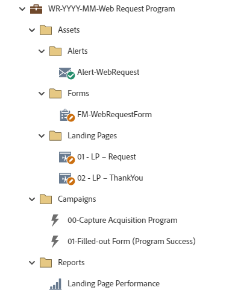

# WR-YYYY-MM-Web Request Program {#wr-yyyy-mm-web-request-program}

This is an example program ideal for contact request, quote request, demo request, or trial request forms utilizing a Marketo Engage Default Program. Can be used with Marketo Landing Pages, or as an embedded form on non-Marketo landing pages. An alert email is sent to a specified individual upon form submission.

For further strategy assistance or help customizing a program, please contact the Adobe Account Team or visit the [Adobe Professional Services](https://business.adobe.com/customers/consulting-services/main.html){target="_blank"} page.

## Channel Summary {#channel-summary}

<table style="table-layout:auto"> 
 <tbody> 
  <tr> 
   <th>Channel</th> 
   <th>Membership Status</th>
   <th>Analytics Behavior</th>
   <th>Program Type</th>
  </tr> 
  <tr> 
   <td>Web Request</td> 
   <td>01 - Engaged - Success</td>
   <td>Inclusive</td>
   <td>Default</td>
  </tr>
 </tbody> 
</table>

## Program Contains the Following Assets {#program-contains-the-following-assets}

<table style="table-layout:auto"> 
 <tbody> 
  <tr> 
   <th>Type</th> 
   <th>Template Name</th>
   <th>Asset Name</th>
  </tr>
  <tr> 
   <td>Form</td> 
   <td>&nbsp</td>
   <td>FM-WebRequestForm</td>
  </tr>
  <tr> 
   <td>Email</td> 
   <td><a href="/help/marketo/product-docs/core-marketo-concepts/programs/program-library/quick-start-email-template.md" target="_blank">Quick Start Email Template</a></td>
   <td>Alert-WebRequest</td>
  </tr>
  <tr> 
   <td>Landing Page</td> 
   <td><a href="/help/marketo/product-docs/core-marketo-concepts/programs/program-library/quick-start-landing-page-template.md" target="_blank">Quick Start LP Template</a></td>
   <td>01 - LP - Request</td>
  </tr>
  <tr> 
   <td>Landing Page</td> 
   <td><a href="/help/marketo/product-docs/core-marketo-concepts/programs/program-library/quick-start-landing-page-template.md" target="_blank">Quick Start LP Template</a></td>
   <td>02 - LP - ThankYou</td>
  </tr>
  <tr> 
   <td>Local Report</td> 
   <td>&nbsp</td>
   <td>Landing Page Performance</td>
  </tr>
   <tr> 
   <td>Smart Campaign</td> 
   <td>&nbsp</td>
   <td>New Person from Web Request</td>
  </tr>
   <tr> 
   <td>Smart Campaign</td> 
   <td>&nbsp</td>
   <td>New Person from Webinar</td>
  </tr>
  <tr> 
   <td>Folder</td> 
   <td>&nbsp</td>
   <td>Assets - Houses all creative assets 
 (subfolders for Alerts & Landing Pages)</td>
  </tr>
  <tr> 
   <td>Folder</td> 
   <td>&nbsp</td>
   <td>Campaigns - Houses all Smart Campaigns</td>
  </tr>
  <tr> 
   <td>Folder</td> 
   <td>&nbsp</td>
   <td>Reports</td>
  </tr>
 </tbody> 
</table>

## My Tokens Included {#my-tokens-included}

<table style="table-layout:auto"> 
 <tbody> 
  <tr> 
   <th>Token Type</th> 
   <th>Token Name</th>
   <th>Value</th>
  </tr>
  <tr> 
   <td>Text</td> 
   <td><code>{{my.Request-Type}}</code></td>
   <td>Contact Us</td>
  </tr>
  <tr> 
   <td>Text</td> 
   <td><code>{{my.ALERT-FromAddress}}</code></td>
   <td>PlaceholderFrom.email@mydomain.com</td>
  </tr>
  <tr> 
   <td>Text</td> 
   <td><code>{{my.ALERT-FromName}}</code></td>
   <td><code><--My From Name Here--></code></td>
  </tr>
  <tr> 
   <td>Text</td> 
   <td><code>{{my.ALERT-ReplyToAddress}}</code></td>
   <td>reply-to.email@mydomain.com</td>
  </tr>
  <tr> 
   <td>Text</td> 
   <td><code>{{my.PageURL-ThankYou}}</code></td>
   <td>My.ThankYouPageURL?without the http://</td>
  </tr>
 </tbody> 
</table>

## Conflict Rules {#conflict-rules}

* **Program Tags**
   * Create tags in this subscription - _Recommended_
   * Ignore

* **Landing Page template with the same name**
   * Copy original template
   * Use destination template - _Recommended_

* **Images with the same name**
   * Keep both files
   * Replace item in this subscription - _Recommended_

* **Email templates with the same name**
   * Keep both templates
   * Replace existing template - _Recommended_

## Best Practices {#best-practices}

* After import of the webinar program, move the form from a local asset to a global asset located in the Design Studio.
   * Decreasing the number of forms and utilizing more global assets from the Design Studio allows more scalability in your program design and administrative governance. It also provides flexibility for regular compliance updates for fields, opt-in language, etc. 

* Consider updating the templates in your imported program to utilize currently branded templates, or update the newly imported template to reflect your brand by adding in a snippet or your appropriate logo/footer information.

* Consider updating the naming convention of this program example to align to your naming convention.

>[!NOTE]
>
>Remember to update the My Token Values on the program template and each time you use the program, as needed.

>[!IMPORTANT]
>
>My Tokens that reference a URL cannot contain the http:// or https:// otherwise the link will not work appropriately within the asset.
