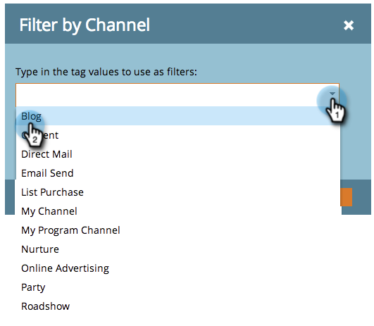
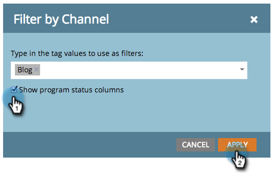
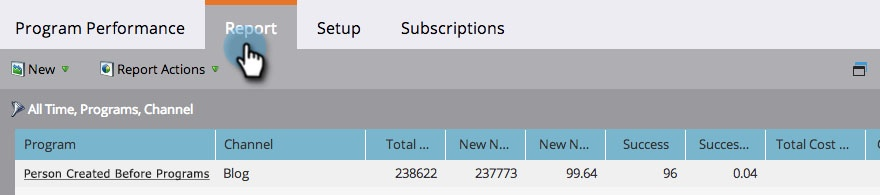

# Add Program Status Columns to a Program Report {#add-program-status-columns-to-a-program-report}

Add stats about program status to your [program performance report](create-a-program-performance-report.md).

##### 1. Go to Marketing Activities (or Analytics).  {#go-to-marketing-activities-or-analytics}

  

##### 2. Select your report. {#select-your-report}

 

##### 3. Click the Setup tab and drag over the Channel tag. {#click-the-setup-tab-and-drag-over-the-channel-tag}

 

##### 4. Select a channel to filter by. {#select-a-channel-to-filter-by}

>[!TIP]
>
>To show program status columns, your report must be filtered by *just one* channel.

##### 5. Check the option to Show program status columns. Click Apply. {#check-the-option-to-show-program-status-columns-click-apply}

  

##### 6. You did it! Click the Report tab to see your report with the program status columns. {#you-did-it-click-the-report-tab-to-see-your-report-with-the-program-status-columns}

>[!NOTE]
>
>If you do not see a column for each status in the program, make sure you have [selected the columns to show](../../../../product-docs/reporting/basic-reporting/editing-reports/select-report-columns.md) in the report.

>[!NOTE]
>
>**Related Articles**
>
>* [Filter a Program Report by Tag](filter-a-program-report-by-tag.md)
>

>[!NOTE]
>
>**Deep Dive**
>
>Learn more in [Basic Reporting](http://docs.marketo.com/display/docs/basic+reporting).

