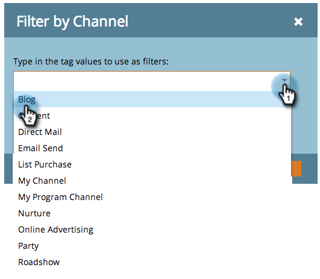

# Add Program Status Columns to a Program Report {#add-program-status-columns-to-a-program-report}

Add stats about program status to your [program performance report](/help/marketo/product-docs/core-marketo-concepts/programs/program-performance-report/create-a-program-performance-report.md){target="_blank"}.

1. Go to **[!UICONTROL Marketing Activities]** (or **[!UICONTROL Analytics]**).

   

1. Select your report.

   

1. Click the **[!UICONTROL Setup]** tab and drag over the **[!UICONTROL Channel]** tag.

   

1. Select a channel to filter by.

   

   >[!TIP]
   >
   >To show program status columns, your report must be filtered by _just one_ channel.

1. Check the option to Show program status columns. Click **[!UICONTROL Apply]**.

   

1. Click the [!UICONTROL Report] tab to see your report with the program status columns.

   

>[!NOTE]
>
>If you do not see a column for each status in the program, make sure you have [selected the columns to show](/help/marketo/product-docs/reporting/basic-reporting/editing-reports/select-report-columns.md){target="_blank"} in the report.

>[!MORELIKETHIS]
>
>[Filter a Program Report by Tag](/help/marketo/product-docs/core-marketo-concepts/programs/program-performance-report/filter-a-program-report-by-tag.md){target="_blank"}
