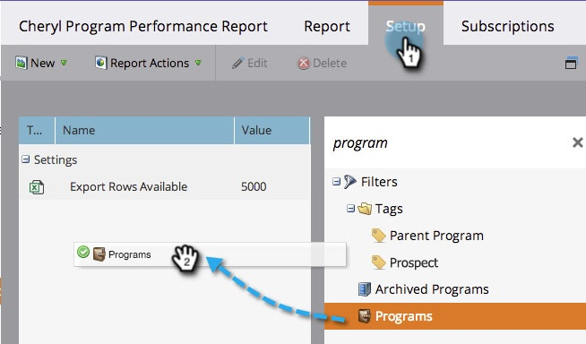
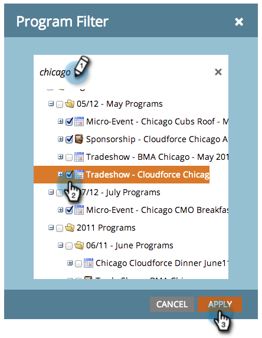
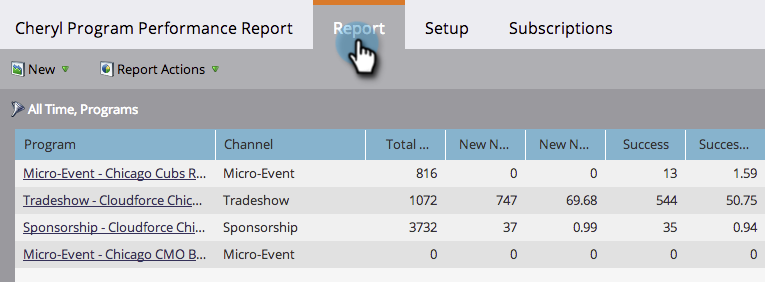

# Filter a Program Report by Program {#filter-a-program-report-by-program}

Focus your [program performance report](/help/marketo/product-docs/core-marketo-concepts/programs/program-performance-report/create-a-program-performance-report.md) on specific programs to compare their performance.

1. Go to **Marketing** **Activities** (or **Analytics**).

   

1. Select your program performance report.

   

1. Click the **Setup** tab and drag over **Programs**.

   

1. Choose the folders and specific programs to include in your report.

   

   >[!TIP]
   >
   >If you select a folder, your report will include everything that folder contains at the time the report runs.

1. That's all! Click the **Report** tab to see _just_ the selected programs in your report.

   

   >[!NOTE]
   >
   >[Filter a Program Report by Tag](/help/marketo/product-docs/core-marketo-concepts/programs/program-performance-report/filter-a-program-report-by-tag.md)
