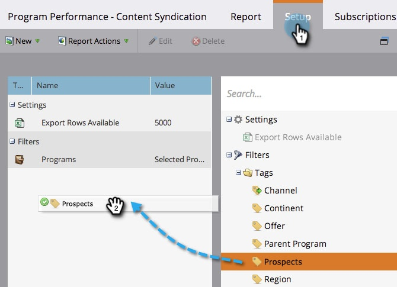
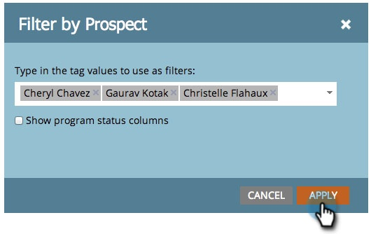
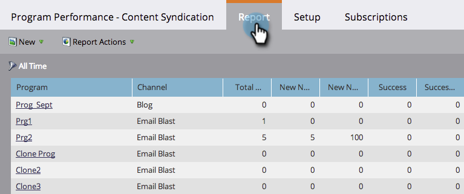

# Filter a Program Report by Tag {#filter-a-program-report-by-tag}

Focus your [program performance report](/help/marketo/product-docs/core-marketo-concepts/programs/program-performance-report/create-a-program-performance-report.md) on specific [tags](/help/marketo/product-docs/core-marketo-concepts/programs/working-with-programs/understanding-tags.md){target="_blank"}.

1. Go to **[!UICONTROL Marketing Activities]** (or **[!UICONTROL Analytics]**).

   

1. Select your **[!UICONTROL Program Performance]** report.

   

1. Click the **[!UICONTROL Setup]** tab and drag over one of the **[!UICONTROL Tags]** filters.

   

1. Choose the tag values to include in your report.

     

1. Click **[!UICONTROL Apply]**.

   

1. Done! Click the **[!UICONTROL Report]** tab to see _just_ the programs that match the selected tags in your report.

   

>[!NOTE]
>
>[Filter a Program Report by Period Cost](/help/marketo/product-docs/core-marketo-concepts/programs/program-performance-report/filter-a-program-report-by-period-cost.md){target="_blank"}
