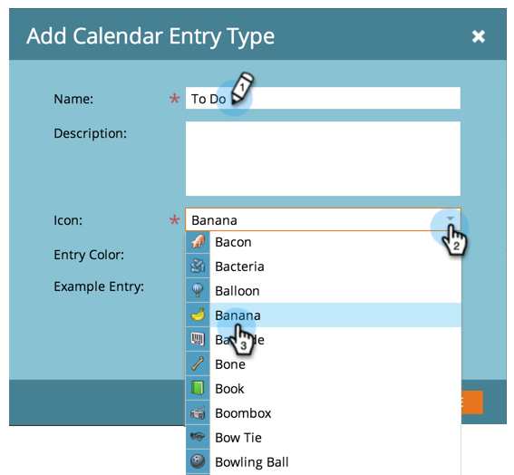
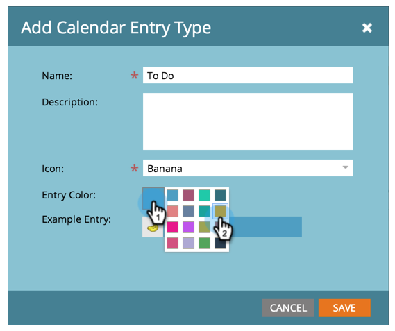
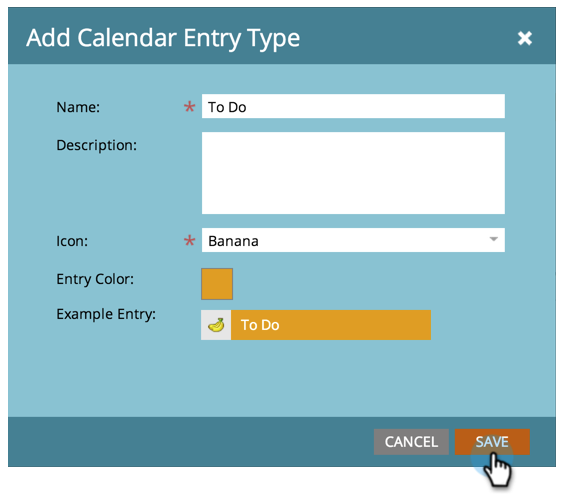

# Create Custom Entry Types {#create-custom-entry-types}

You can create custom entry types to use in your Program Schedule View. This will allow you to keep track of all your non-Marketo agenda items that affect your program.

1. Go to the **Admin** section and click **Tags**.

   

1. Click **Calendar Entry Type**.

   

1. Click the **New** drop-down and select **Entry Type**.

   

1. Name your entry and select an icon.

   

1. Select an **Entry Color**.

   

1. Click **Save**.

   

Great! Now when you create a new entry in your schedule view, this type will be an option.

>[!NOTE]
>
>You can create up to 100 custom entry types.

