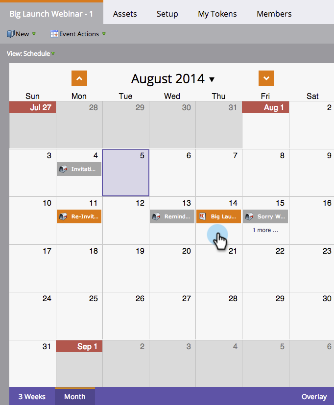
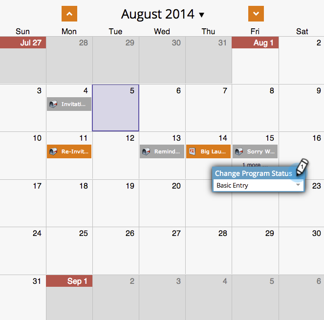
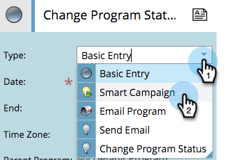
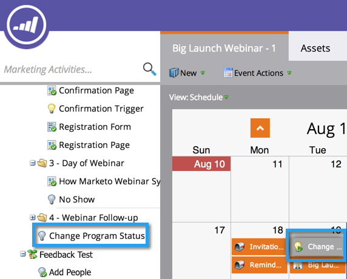
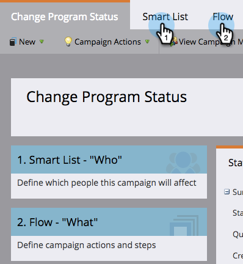
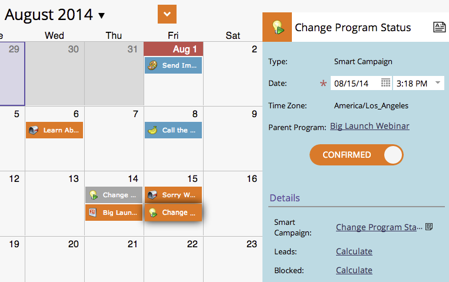

# Creating a Batch Smart Campaign in the Program Schedule View {#creating-a-batch-smart-campaign-in-the-program-schedule-view}

You can create new smart campaigns and [rerun existing ones](/help/marketo/product-docs/core-marketo-concepts/programs/program-schedule-view/rerun-a-smart-campaign-in-the-program-schedule-view.md) inside your program from the program schedule view.

>[!NOTE]
>
>Only batch smart campaigns can be created in this view. Trigger campaigns are not supported.

1. Select the date on which you'd like your new smart campaign to run.

   

1. Choose a name for your entry, which will become your new smart campaign. Press the **Enter/Return** key to confirm the name.

   

1. Click the **[!UICONTROL Type]** drop-down and choose **[!UICONTROL Smart Campaign]**.

   

   >[!NOTE]
   >
   >You can also run an existing smart campaign by selecting it from the drop-down.

   

1. Choose your [smart campaign](/help/marketo/product-docs/core-marketo-concepts/smart-campaigns/creating-a-smart-campaign/create-a-new-smart-campaign.md) rules.

   

1. You'll now see this smart campaign as confirmed in the schedule view and in the entry details.

   

This will create a new smart campaign run in your program.
